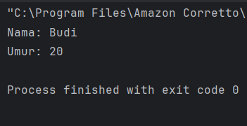
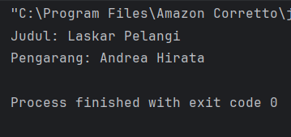
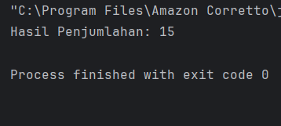
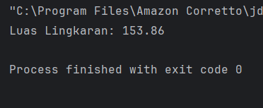
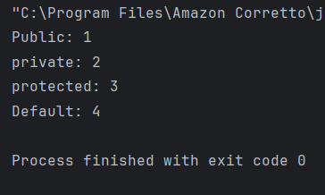
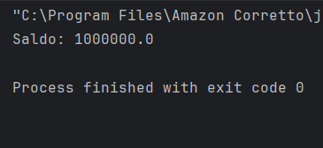
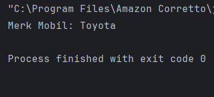
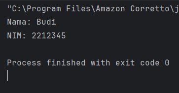
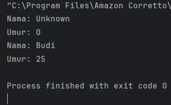
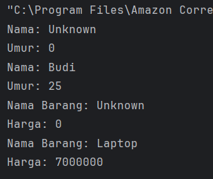

# Laporan 1 : Review Konsep Dasar OOP Menggunakan Java
**Mata Kuliah:** Praktikum Design Pattern  
**Nama:** [Muhammad Aqil Yuanza]  
**NIM:** [2024573010101]  
**Kelas:** [TI 2A]

---

## 1. Abstrak
Pemrograman Berorientasi Objek atau Object-Oriented Programming (OOP) merupakan paradigma pemrograman yang berfokus pada konsep objek sebagai representasi dari data dan perilaku. Bahasa pemrograman Java menjadi salah satu bahasa yang широко digunakan dalam penerapan OOP karena mendukung prinsip-prinsip utamanya secara lengkap. Penelitian atau kajian ini bertujuan untuk mereview konsep dasar OOP yang meliputi class, object, encapsulation, inheritance, polymorphism, dan abstraction. Melalui pendekatan deskriptif, pembahasan dilakukan dengan menjelaskan setiap konsep serta implementasinya dalam bahasa Java. Hasil dari kajian ini menunjukkan bahwa pemahaman konsep dasar OOP sangat penting dalam membangun program yang terstruktur, modular, dan mudah untuk dikembangkan maupun dipelihara. Dengan memanfaatkan fitur-fitur OOP pada Java, pengembang dapat meningkatkan efisiensi serta kualitas perangkat lunak yang dihasilkan.
## 2. Praktikum
### Praktikum 1 - Class dan Object
#### Dasar Teori
1. Class adalah blueprint atau cetakan untuk membuat objek. Class mendefinisikan atribut (variabel) dan method (fungsi) yang dimiliki oleh objek.
2. Object adalah instance dari class. Object memiliki state (nilai dari atribut) dan behavior (method).

#### Langkah Praktikum
1. Buka project pada praktikum sebelumnya menggunakan intellij IDEA
2. Buat sebuah package baru di dalam folder src dengan cara klik kanan pada folder src kemudian pilih New -> Package. Beri nama praktikum_2
3. Buat Sebuah package baru lagi didalam package praktikum_2 dengan cara klik kanan dan pilih New -> Package. Beri nama bagian_1
4. Kemudian buat sebuah class baru dengan nama Mahasiswa dan isikan kode berikut:

         package praktikum_2.bagian_1;

         public class Mahasiswa {
         String nama;
         int umur;
         }
5. Selanjutnya, buat sebuah class baru dengan nama Main dan isikan kode berikut:

        package praktikum_2.bagian_1;

        public class Main {
        public static void main(String[] args) {
        //Membuat object daru class mahasiswa
        Mahasiswa mhs1 = new Mahasiswa();

        // mengisi nilai atribut
        mhs1.nama = "Budi";
        mhs1.umur = 20;

        // Menampilkan nilai atribut
        System.out.println("Nama: " + mhs1.nama);
        System.out.println("Umur: " + mhs1.umur);
        }
        }
6. Jalankan dan lihat hasilnya.
#### Screeenshoot Hasil

### Latihan - Prak 1
1. Buatlah class Buku dengan atribut judul dan pengarang.
2. Buat object dari class Buku dan isi nilai atributnya.
3. Tampilkan nilai atribut tersebut.

- Class buku

        package praktikum_2.latihan.latihan_1;

        public class Buku {String judul; String pengarang;
        }

- Main

        package praktikum_2.latihan.latihan_1;

        public class Main {
        public static void main(String[] args) {

        // Membuat object dari class Buku
        Buku buku1 = new Buku();

        // Mengisi nilai atribut
        buku1.judul = "Laskar Pelangi";
        buku1.pengarang = "Andrea Hirata";

        // Menampilkan nilai atribut
        System.out.println("Judul: " + buku1.judul);
        System.out.println("Pengarang: " + buku1.pengarang);
        }
        }
#### Screenshoot Hasil

### Praktikum 2 - Attribute dan Method  
#### Dasar Teori
1. Attribute adalah variabel yang dimiliki oleh class atau object.
2. Method adalah fungsi atau perilaku yang dimiliki oleh class atau object.

#### Langkah Praktikum
1. Buat Sebuah package baru lagi didalam package praktikum_2 dengan cara klik kanan dan pilih New -> Package. Beri nama bagian_2
2. Kemudian buat sebuah class baru dengan nama Kalkulator dan isikan kode berikut:

       package praktikum_2.bagian_2;

       public class kalkulator {
       // Atribut
       int angka1;
       int angka2;
       // Method
       int tambah() {
       return angka1 + angka2;
       }
       }
3. Kemudian buat sebuah class baru dengan nama Main dan isikan kode berikut:

       package Praktikum_2.Bagian_2;
       public class Main {
       public static void main(String[] args) {
       Kalkulator kalkulator = new Kalkulator();
       kalkulator.angka1 = 5;
       kalkulator.angka2 = 10;
       System.out.println("Hasil Penjumlahan: " + kalkulator.tambah());
       }
       }
4. Jalankan program untuk melihat hasilnya.
#### Screenshoot Hasil

### Latihan - Prak 2
1. Buat class Lingkaran dengan atribut jariJari.
2. Tambahkan method hitungLuas() yang mengembalikan nilai luas lingkaran.
3. Buat object dari class Lingkaran dan panggil method hitungLuas().

- Lingkaran

       package praktikum_2.latihan.latihan_2;

       public class Lingkaran {
       // Atribut
       double jariJari;
       // Method untuk menghitung luas
       double hitungLuas() {
       return 3.14 * jariJari * jariJari;
       }
       }
-  Main

       package praktikum_2.latihan.latihan_2;

       public class Main {
       public static void main(String[] args) {

       // Membuat object
       Lingkaran lingkaran1 = new Lingkaran();

       // Mengisi nilai jari-jari
       lingkaran1.jariJari = 7;

       // Menampilkan hasil luas
       System.out.println("Luas Lingkaran: " + lingkaran1.hitungLuas());
       }
       }
#### Screenshoot Hasil

### Praktikum 3 - Akses Modifier
1. Akses Modifier menentukan tingkat akses dari class, atribut, atau method.
2. Jenis akses modifier:
- public : Dapat diakses dari mana saja.
- private : Hanya dapat diakses dalam class yang sama.
- protected : Dapat diakses dalam package yang sama dan subclass.
- default : Hanya dapat diakses dalam package yang sama.

#### Langkah Praktikum
1. Buat Sebuah package baru lagi didalam package praktikum_2 dengan cara klik kanan dan pilih New -> Package. Beri nama bagian_3
2. Kemudian buat sebuah class baru dengan nama AksesModifier dan isikan kode berikut:

        package Praktikum_2.Bagian_3;
        public class AksesModifier {
        public int publicVar = 1;
        private int privateVar = 2;
        protected int protectedVar = 3;
        int defaultVar = 4;
        public void tampilkan() {
        System.out.println("Public: " + publicVar);
        System.out.println("private: " + privateVar);
        System.out.println("protected: " + protectedVar);
        System.out.println("Default: "+ defaultVar);
        }
        }
3. Kemudian buat sebuah class baru dengan nama Main dan isikan kode berikut:

        package Praktikum_2.Bagian_3;
        public class Main {
        public static void main(String[] args){
        AksesModifier contoh = new AksesModifier();
        contoh.tampilkan();
        }
        }
4.  Jalankan program dan lihat hasilnya.
#### Sreenshoot Hasil

### Latihan - Prak 3
1. Buat class AkunBank dengan atribut saldo (private) dan method tampilkanSaldo() (public).
2. Coba akses atribut saldo langsung dari luar class. Apa yang terjadi?

- AkunBank

        package praktikum_2.latihan.latihan_3;
        
        public class AkunBank {
        // Atribut private
        private double saldo;
        // Method untuk menampilkan saldo
        public void tampilkanSaldo() {
        System.out.println("Saldo: " + saldo);
        }
        // Method untuk mengisi saldo (biar bisa diubah dari luar)
        public void setSaldo(double saldo) {
        this.saldo = saldo;
        }
        
        }

- Main

        package praktikum_2.latihan.latihan_3;
        
        public class Main {
        public static void main(String[] args) {
        // Membuat object
        AkunBank akun = new AkunBank();
        // Mengisi saldo lewat method
        akun.setSaldo(1000000);
        // Menampilkan saldo
        akun.tampilkanSaldo();
        // Ini akan error jika diaktifkan
        // akun.saldo = 500000;
        }
        }
#### Screenshoot Hasil

### Praktikum 4 - Setter dan Getter
1. Setter adalah method untuk mengubah nilai atribut.
2. Getter adalah method untuk mengambil nilai atribut.
3. Setter dan Getter digunakan untuk mengakses atribut yang memiliki akses modifier private.

#### Langkah Praktikum
1. Buat Sebuah package baru lagi didalam package praktikum_2 dengan cara klik kanan dan pilih New -> Package. Beri nama bagian_4
2. Kemudian buat sebuah class baru dengan nama Mobil dan isikan kode berikut:

        package praktikum_2.bagian_4;
        
        public class Mobil {
        private String merk;
        //setter
        public void setMerk(String merk) {
        this.merk = merk;
        }
        //Getter
        public String getMerk() {
        return merk;
        }
        }
3. Kemudian buat sebuah class baru dengan nama Main dan isikan kode berikut:

        package praktikum_2.bagian_4;
        
        public class Main {
        public static void main(String[] args) {
        Mobil mobil = new Mobil();
        mobil.setMerk("Toyota");
        System.out.println("Merk Mobil: " +mobil.getMerk());
        }
        }
4. Jalankan program untuk melihat hasilnya.
#### Screenshoot Hasil

### Latihan - Prak 4
1. Buat class Mahasiswa dengan atribut nama (private) dan nim (private).
2. Buat setter dan getter untuk kedua atribut tersebut.
3. Buat object dari class Mahasiswa dan gunakan setter untuk mengisi nilai atribut.

- Mahasiswa

        package praktikum_2.latihan.latihan_4;
        
        public class Mahasiswa {
        // Atribut private
        private String nama;
        private String nim;
        // Setter
        public void setNama(String nama) {
        this.nama = nama;
        }
        public void setNim(String nim) {
        this.nim = nim;
        }
        // Getter
        public String getNama() {
        return nama;
        }
        public String getNim() {
        return nim;
        }
        
        }

- Main

        package praktikum_2.latihan.latihan_4;
        
        public class Main {
        public static void main(String[] args) {
        // Membuat object
        Mahasiswa mhs = new Mahasiswa();
        // Mengisi nilai dengan setter
        mhs.setNama("Budi");
        mhs.setNim("2212345");
        // Menampilkan dengan getter
        System.out.println("Nama: " + mhs.getNama());
        System.out.println("NIM: " + mhs.getNim());
        }
        
        }
#### Screenshoot Hasil

### Praktikum 5 - Constructor
1. Constructor adalah method khusus yang dipanggil saat object dibuat.
2. Jenis constructor:
- Default Constructor : Tanpa parameter.
- Parameterized Constructor : Dengan parameter.
- Constructor Overloading : Beberapa constructor dengan parameter berbeda.

#### Langkah Praktikum
1. Buat Sebuah package baru lagi didalam package praktikum_2 dengan cara klik kanan dan pilih New -> Package. Beri nama bagian_5
2. Kemudian buat sebuah class baru dengan nama Person dan isikan kode berikut:

        package praktikum_2.bagian_5;
        
        public class Person {
        private String nama;
        private int umur;
        //Default Constructor
        public Person() {
        nama = "Unknown";
        umur = 0;
        }
        //parameterized Constructor
        public Person(String nama, int umur) {
        this.nama = nama;
        this.umur = umur;
        }
        //Method
        public void tampilkanInfo(){
        System.out.println("Nama: " + nama);
        System.out.println("Umur: " + umur);
        }
        }
3. Kemudian buat sebuah class baru dengan nama Main dan isikan kode berikut:

        package praktikum_2.bagian_5;
        
        public class Main {
        public static void main(String[] args){
        Person person1 = new Person();
        Person person2 = new Person("Budi", 25);
        person1.tampilkanInfo();
        person2.tampilkanInfo();
        }
        }
4. Jalankan program untuk melihat hasilnya.
#### Screenshoot Hasil

### Latihan - Prak 5
1. Buat class Barang dengan atribut namaBarang dan harga.
2. Buat default constructor dan parameterized constructor.
3. Buat object dari class Barang menggunakan kedua constructor tersebut.

- Barang

        package praktikum_2.latihan.latihan_5;
        
        public class Barang {
        private String namaBarang;
        private int harga;
        // Default Constructor
        public Barang() {
        namaBarang = "Unknown";
        harga = 0;
        }
        // Parameterized Constructor
        public Barang(String namaBarang, int harga) {
        this.namaBarang = namaBarang;
        this.harga = harga;
        }
        // Method untuk menampilkan data
        public void tampilkanInfo() {
        System.out.println("Nama Barang: " + namaBarang);
        System.out.println("Harga: " + harga);
        }
        
        }
- Main

        package Praktikum_2.Latihan.Latihan_5;
        
        import praktikum_2.bagian_5.Person;
        import praktikum_2.latihan.latihan_5.Barang;
        
        public class Main {
        public static void main(String[] args) {
        // Object Person (dari soal sebelumnya)
        Person person1 = new Person();
        Person person2 = new Person("Budi", 25);
        person1.tampilkanInfo();
        person2.tampilkanInfo();
        
        // Object Barang
        Barang barang1 = new Barang();
        Barang barang2 = new Barang("Laptop", 7000000);
        barang1.tampilkanInfo();
        barang2.tampilkanInfo();
        }
        }
#### Screenshoot Hasil

### Praktikum 6 - Sistem Manajemen Perpustakaan Sederhana
Berikut adalah contoh program konsol sederhana yang mengimplementasikan seluruh konsep yang telah dibahas sebelumnya, yaitu class, object, attribute, method, akses modifier, setter-getter, dan constructor. Program ini adalah sistem manajemen perpustakaan sederhana yang memungkinkan pengguna untuk menambahkan buku, menampilkan daftar buku, dan mencari buku berdasarkan judul.

#### Langkah Praktikum
1. Buat Sebuah package baru lagi didalam package praktikum_2 dengan cara klik kanan dan pilih New -> Package. Beri nama bagian_6
2. Kemudian buat sebuah class baru dengan nama Buku dan isikan kode berikut:

        package praktikum_2.latihan.latihan_6;
        
        public class Buku {
        // Atribut (private)
        private String judul;
        private String pengarang;
        private int tahunTerbit;
        // Constructor (default)
        public Buku() {
        this.judul = "Unknown";
        this.pengarang = "Unknown";
        this.tahunTerbit = 0;
        }
        // Constructor (parameterized)
        public Buku(String judul, String pengarang, int tahunTerbit) {
        this.judul = judul;
        this.pengarang = pengarang;
        this.tahunTerbit = tahunTerbit;
        }
        // Setter dan Getter
        public void setJudul(String judul) {
        this.judul = judul;
        }
        public String getJudul() {
        return judul;
        }
        public void setPengarang(String pengarang) {
        this.pengarang = pengarang;
        }
        public String getPengarang() {
        return pengarang;
        }
        public void setTahunTerbit(int tahunTerbit) {
        this.tahunTerbit = tahunTerbit;
        }
        public int getTahunTerbit() {
        return tahunTerbit;
        }
        // Method untuk menampilkan informasi buku
        public void tampilkanInfo() {
        System.out.println("Judul: " + judul);
        System.out.println("Pengarang: " + pengarang);
        System.out.println("Tahun Terbit: " + tahunTerbit);
        System.out.println("----------------------------");
        }
        }
3. Kemudian buat sebuah class baru dengan nama Perpustakaan dan isikan kode berikut:

        package praktikum_2.latihan.latihan_6;
        
        import java.util.ArrayList;
        
        public class Perpustakaan {
        // Atribut (private)
        private ArrayList<Buku> daftarBuku;
        // Constructor
        public Perpustakaan() {
        daftarBuku = new ArrayList<>();
        }
        // Method untuk menambahkan buku
        public void tambahBuku(Buku buku) {
        daftarBuku.add(buku);
        System.out.println("Buku berhasil ditambahkan!");
        }
        // Method untuk menampilkan semua buku
        public void tampilkanSemuaBuku() {
        if (daftarBuku.isEmpty()) {
        System.out.println("Tidak ada buku dalam perpustakaan.");
        } else {
        System.out.println("Daftar Buku:");
        for (Buku buku : daftarBuku) {
        buku.tampilkanInfo();
        }
        }
        }
        // Method untuk mencari buku berdasarkan judul
        public void cariBuku(String judul) {
        boolean ditemukan = false;
        for (Buku buku : daftarBuku) {
        if (buku.getJudul().equalsIgnoreCase(judul)) {
        System.out.println("Buku ditemukan:");
        buku.tampilkanInfo();
        ditemukan = true;
        break;
        }
        }
        if (!ditemukan) {
        System.out.println("Buku dengan judul \"" + judul + "\" tidak ditemukan.");
        }
        }
        }
4. Kemudian buat sebuah class baru dengan nama Main dan isikan kode berikut:

        package praktikum_2.latihan.latihan_6;
        
        import java.util.Scanner;
        
        public class Main {
        public static void main(String[] args) {
        Scanner scanner = new Scanner(System.in);
        Perpustakaan perpustakaan = new Perpustakaan();
        int pilihan;
        do {
        // Menu
        System.out.println("\n=== Sistem Manajemen Perpustakaan ===");
        System.out.println("1. Tambah Buku");
        System.out.println("2. Tampilkan Semua Buku");
        System.out.println("3. Cari Buku");
        System.out.println("4. Keluar");
        System.out.print("Pilih menu: ");
        pilihan = scanner.nextInt();
        scanner.nextLine(); // Membersihkan newline
        switch (pilihan) {
        case 1:
        // Tambah Buku
        System.out.print("Masukkan judul buku: ");
        String judul = scanner.nextLine();
        System.out.print("Masukkan nama pengarang: ");
        String pengarang = scanner.nextLine();
        System.out.print("Masukkan tahun terbit: ");
        int tahunTerbit = scanner.nextInt();
        scanner.nextLine(); // Membersihkan newline
        Buku bukuBaru = new Buku(judul, pengarang, tahunTerbit);
        perpustakaan.tambahBuku(bukuBaru);
        break;
        case 2:
        // Tampilkan Semua Buku
        perpustakaan.tampilkanSemuaBuku();
        break;
        case 3:
        // Cari Buku
        System.out.print("Masukkan judul buku yang dicari: ");
        String judulCari = scanner.nextLine();
        perpustakaan.cariBuku(judulCari);
        break;
        case 4:
        // Keluar
        System.out.println("Terima kasih telah menggunakan sistem ini!");
        break;
        default:
        System.out.println("Pilihan tidak valid. Silakan coba lagi.");
        }
        } while (pilihan != 4);
        scanner.close();
        }
        }
5. Jalankan program untuk melihat hasilnya.

#### Screenshoot Hasil

