# Laporan 1 : Review Konsep Dasar OOP Menggunakan Java
**Mata Kuliah:** Praktikum Design Pattern  
**Nama:** [Muhammad Aqil Yuanza]  
**NIM:** [2024573010101]  
**Kelas:** [TI 2A]

---

## 1. Abstrak
Pemrograman Berorientasi Objek atau Object-Oriented Programming (OOP) merupakan paradigma pemrograman yang berfokus pada penggunaan objek untuk merepresentasikan data dan perilaku dalam suatu sistem. Dalam bahasa pemrograman Java, konsep OOP menjadi dasar utama dalam pengembangan aplikasi yang terstruktur dan modular. Empat pilar utama dalam OOP terdiri dari Encapsulation, Inheritance, Polymorphism, dan Abstraction.

Encapsulation memungkinkan pembungkusan data dan metode dalam satu kesatuan sehingga meningkatkan keamanan data. Inheritance memungkinkan pewarisan sifat dari suatu class ke class lain untuk mengurangi redundansi kode. Polymorphism memberikan fleksibilitas dalam penggunaan metode dengan nama yang sama namun memiliki perilaku berbeda. Sedangkan Abstraction berfungsi untuk menyederhanakan kompleksitas dengan hanya menampilkan informasi penting kepada pengguna.

Dengan menerapkan keempat pilar tersebut, pengembangan perangkat lunak menjadi lebih efisien, mudah dipelihara, serta memiliki tingkat skalabilitas yang tinggi. Oleh karena itu, pemahaman terhadap konsep dasar OOP dalam Java sangat penting bagi pengembang dalam membangun sistem yang optimal dan terstruktur.

## 2. Praktikum
### Praktikum 1 - Pengenalan OOP dan Class-Object
#### Dasar Teori
OOP (Object-Oriented Programming) adalah paradigma pemrograman yang menggunakan "objek" untuk merepresentasikan data dan metode yang beroperasi pada data tersebut. Konsep dasar OOP:
1. Class: Blueprint atau template untuk membuat objek.
2. Object: Instance dari class yang memiliki atribut dan metode.

#### Langkah Praktikum
1. Buka project pada praktikum sebelumnya menggunakan intellij IDEA
2. Buat sebuah package baru di dalam folder src dengan cara klik kanan pada folder src kemudian pilih New -> Package. Beri nama modul_3.
3. Buat Sebuah package baru lagi didalam package modul_3 dengan cara klik kanan dan pilih New -> Package. Beri nama bagian_1
4. Kemudian buat sebuah class baru dengan nama Mahasiswa dan isikan kode berikut:

        package praktikum_3.bagian_1;
        
        public class Mahasiswa {
        String nama;
        int umur;
        // Metode
        void displayInfo() {
        System.out.println("Nama: " + nama);
        System.out.println("Umur: " + umur);
        }
        }
5. Selanjutnya, buat sebuah class baru dengan nama Main dan isikan kode berikut:

        package praktikum_3.bagian_1;
        
        public class Main {
        public static void main(String[] args) {
        // Membuat objek
        Mahasiswa mhs1 = new Mahasiswa();
        mhs1.nama = "Budi";
        mhs1.umur = 20;
        // Memanggil metode
        mhs1.displayInfo();
        }
        }

#### Screenshoot Hasil
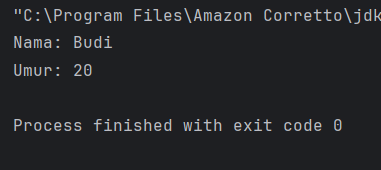

### Latihan - Prak 1
1. Buat class Buku dengan atribut judul, penulis, dan tahunTerbit.
2. Buat objek dari class Buku dan tampilkan informasinya.

- Buku

        package praktikum_3.latihan.latihan_1;
        
        public class Buku {// Atribut String judul; String penulis; int tahunTerbit;
        
        // Metode untuk menampilkan informasi void tampilInfo() { System.out.println("Judul: " + judul); System.out.println("Penulis: "+ penulis); System.out.println("Tahun Terbit: " + tahunTerbit);
        }
- Main

        package praktikum_3.latihan.latihan_1;
    
        public class Buku {// Atribut
        String judul; String penulis; int tahunTerbit;
    
        // Metode untuk menampilkan informasi
        void tampilInfo()
        {
            System.out.println("Judul: " + judul);
            System.out.println("Penulis: " + penulis);
            System.out.println("Tahun Terbit: " + tahunTerbit);
        }
        }
#### Screenshoot Hasil
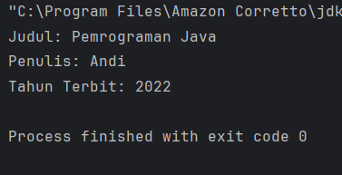

### Praktikum 2 - Encapsulation (Enkapsulasi)
Encapsulation adalah konsep menyembunyikan detail internal objek dan hanya mengekspos fungsionalitas yang diperlukan. Ini dilakukan dengan menggunakan access modifier (private, public, protected) dan getter-setter.

#### Langkah Praktikum
1. Buat Sebuah package baru lagi didalam package modul_3 dengan cara klik kanan dan pilih New -> Package. Beri nama bagian_2
2. Kemudian buat sebuah class baru dengan nama Mahasiswa dan isikan kode berikut:

        package praktikum_3.bagian_2;
        
        public class Mahasiswa2 {
        private String nama;
        private int umur;
        // Getter dan Setter
        public String getNama() {
        return nama;
        }
        public void setNama(String nama) {
        this.nama = nama;
        }
        public int getUmur() {
        return umur;
        }
        public void setUmur(int umur) {
        this.umur = umur;
        }
        }
3. Kemudian buat sebuah class baru dengan nama Main dan isikan kode berikut:

        package praktikum_3.bagian_2;
        
        public class Main {
        public static void main(String[] args) {
        Mahasiswa2 mhs1 = new Mahasiswa2();
        mhs1.setNama("Budi");
        mhs1.setUmur(20);
        System.out.println("Nama : " + mhs1.getNama());
        System.out.println("Umur : " + mhs1.getUmur());
        }
        
        }
4. Jalankan program untuk melihat hasilnya.
#### Screenshoot Hasil
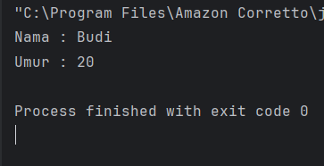

### Latihan - Prak 2
1. Buat class Motor dengan atribut merk dan tahun yang dienkapsulasi.
2. Buat getter dan setter untuk atribut tersebut.

- Motor

        package praktikum_3.latihan.latihan_2;
        
        public class Motor {
        // Atribut private
        private String merk;
        private int tahun;
        // Getter dan Setter untuk merk
        public String getMerk() {
        return merk;
        }
        public void setMerk(String merk) {
        this.merk = merk;
        }
        // Getter dan Setter untuk tahun
        public int getTahun() {
        return tahun;
        }
        public void setTahun(int tahun) {
        this.tahun = tahun;
        }
        }

- Main

        package praktikum_3.latihan.latihan_2;
        
        public class Main {
        public static void main(String[] args) {
        Motor motor1 = new Motor();
        motor1.setMerk("Honda");
        motor1.setTahun(2022);
        System.out.println("Merk Motor: " + motor1.getMerk());
        System.out.println("Tahun Motor: " + motor1.getTahun());
        }
        }
#### Screenshoot Hasil
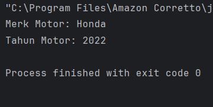

### Praktikum 3 - Inheritance (Pewarisan) dan Composition (Komposisi)
Dalam pemrograman berorientasi objek (OOP), Inheritance dan Composition adalah dua konsep penting yang digunakan untuk membangun hubungan antara class. Meskipun keduanya memiliki tujuan yang sama, yaitu mempromosikan reuseability (penggunaan kembali kode) dan modularitas, mereka memiliki pendekatan yang berbeda. Berikut adalah penjelasan lengkap tentang Composition dan perbandingannya dengan Inheritance.

Inheritance (Pewarisan)

Inheritance adalah mekanisme di mana sebuah class (subclass/child class) mewarisi atribut dan metode dari class lain (superclass/parent class). Inheritance menggambarkan hubungan "is-a" (adalah). Misalnya, Kucing adalah Hewan.

Ciri-Ciri Inheritance:
- Menggunakan keyword extends.
- Subclass mewarisi semua atribut dan metode dari superclass (kecuali yang private).
- Subclass dapat menambahkan atribut dan metode baru, atau meng-override metode yang ada.
- Mendukung hierarki class (class dapat mewarisi dari satu superclass).

#### Langkah Praktikum
1. Buat Sebuah package baru lagi didalam package modul_3 dengan cara klik kanan dan pilih New -> Package. Beri nama bagian_3
2. Buat package baru di dalam bagian_3 dan beri nama pewarisan
3. Kemudian buat sebuah class baru dengan nama Kendaraan dan isikan kode berikut:

        package praktikum_3.bagian_3.pewarisan;
        
        public class Kendaraan {String merk; int tahun;
        void displayInfo() {
        System.out.println("Merk : " + merk);
        System.out.println("Tahun :" + tahun);
        }
        }
4. Kemudian buat sebuah class baru dengan nama Mobil dan isikan kode berikut:

        package praktikum_3.bagian_3.pewarisan;
        
        public class Mobil extends Kendaraan {
        int jumlahPintu;
        void displayInfoMobil() {
        displayInfo();
        System.out.println("Jumlah Pntu: " + jumlahPintu);
        }
        }
5. Kemudian buat sebuah class baru dengan nama Main dan isikan kode berikut:

        package praktikum_3.bagian_3.pewarisan;
        
        public class Main{
        public static void main(String[] args) {
        Mobil mobil1 = new Mobil();
        mobil1.merk = "Toyota";
        mobil1.tahun = 2021;
        mobil1.jumlahPintu = 4;
        
                mobil1.displayInfoMobil();
            }
        }
6. Jalankan program dan lihat hasilnya.
#### Screenshoot Hasil
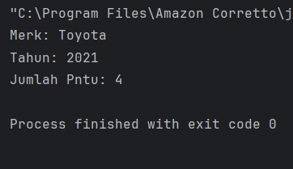

### Composition (Komposisi)
Composition adalah mekanisme di mana sebuah class terdiri dari objek-objek dari class lain. Ini menggambarkan hubungan "has-a" (memiliki). Misalnya, Mobil memiliki Mesin. Composition memungkinkan kita untuk membangun class yang kompleks dengan menggabungkan objek-objek yang lebih sederhana.

Ciri-Ciri Composition:

- Menggunakan instance variabel dari class lain.
- Tidak ada keyword khusus, hanya menggunakan objek sebagai atribut.
- Lebih fleksibel daripada inheritance karena tidak terikat pada hierarki class.
- Mendukung reuseability tanpa perlu mewarisi class.

#### Langkah Praktikum
1. Buat package baru di dalam bagian_3 dan beri nama komposisi
2. Kemudian buat sebuah class baru dengan nama Mesin dan isikan kode berikut:

        package praktikum_3.bagian_3.komposisi;
        
        public class Mesin {
        void hidupkan() {
        System.out.println("Mesin menyala. ");
        }
        void matikan() {
        System.out.println("Mesin dimatikan. ");
        }
        }
3. Kemudian buat sebuah class baru dengan nama Mobil dan isikan kode berikut:

        package praktikum_3.bagian_3.komposisi;
        
        public class Mobil {
        private final Mesin mesin;
        public Mobil() {
        this.mesin = new Mesin();
        }
        void mulai() {
        mesin.hidupkan();
        System.out.println("Mobil siap digunakan.");
        }
        void berhenti() {
        mesin.matikan();
        System.out.println("Mobil berhenti.");
        }
        }
4. Kemudian buat sebuah class baru dengan nama Main dan isikan kode berikut:

        package praktikum_3.bagian_3.komposisi;
        
        public class Main {
        public static void main (String[] args) {
        Mobil mobil = new Mobil();
        mobil.mulai();
        mobil.berhenti();
        }
        }
5. Jalankan program dan lihat hasilnya.
#### Screenshoot Hasil
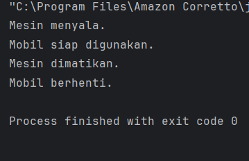

### Perbandingan Inheritance dan Composition
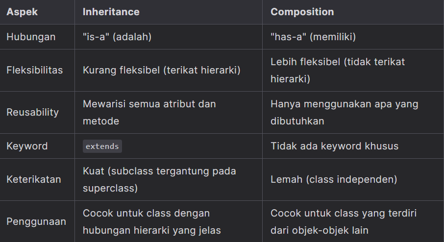

#### Kapan Menggunakan Inheritance vs Composition?
Gunakan Inheritance Jika:
- Ada hubungan "is-a" yang jelas antara class. Misalnya, Mobil adalah Kendaraan.
- Anda ingin mewarisi semua atribut dan metode dari superclass.
- Anda ingin meng-override metode dari superclass.

Gunakan Composition Jika:
- Ada hubungan "has-a" antara class. Misalnya, Mobil memiliki Mesin.
- Anda ingin membangun class yang terdiri dari beberapa objek yang lebih sederhana.
- Anda ingin menghindari keterikatan yang kuat antara class (mengurangi coupling).

Kita juga bisa mengkombinasikan inheritance dengan composition.

#### Langkah Praktikum Kombinasi inheritance dengan composition
1. Di dalam package bagian_3, buat sebuah class baru dan beri nama Main dan isikan kode berikut:

package praktikum_3.bagian_3;

    // Class untuk Composition
    class Mesin {
        void hidupkan() {
            System.out.println("Mesin menyala.");
        }

        void matikan() {
            System.out.println("Mesin dimatikan.");
        }
    }

    // Superclass untuk Inheritance
    class Kendaraan {
        void bergerak() {
            System.out.println("Kendaraan sedang bergerak.");
        }
    }

    // Subclass yang menggunakan Composition dan Inheritance
    class Mobil extends Kendaraan {
        private Mesin mesin; // Composition

        public Mobil() {
            this.mesin = new Mesin(); // Membuat objek Mesin
        }

        void mulai() {
            mesin.hidupkan();
            System.out.println("Mobil siap digunakan.");
        }

        void berhenti() {
            mesin.matikan();
            System.out.println("Mobil berhenti.");
        }
    }

    // Main class (hanya satu!)
    public class Main {
        public static void main(String[] args) {
            Mobil mobil = new Mobil();
            mobil.mulai(); // Composition
            mobil.bergerak(); // Inheritance
            mobil.berhenti(); // Composition
        }
    }
2. Jalankan dan lihat hasilnya
#### Screenshoot Hasil
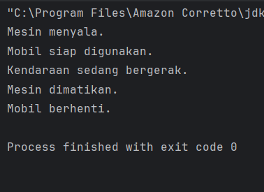

### Latihan - Prak 3
1. Buat class Laptop yang memiliki komponen Processor dan RAM (gunakan composition).
2. Buat class Processor dengan metode jalankan().
3. Buat class RAM dengan metode baca() dan tulis().
4. Implementasikan class Laptop yang menggunakan objek Processor dan RAM.

- Laptop

        package praktikum_3.latihan.latihan_3;
        
        public class Laptop {
        private Processor processor;
        private RAM ram;
        // Constructor (Composition)
        public Laptop() {
        processor = new Processor();
        ram = new RAM();
        }
        public void nyalakanLaptop() {
        System.out.println("Laptop dinyalakan.");
        processor.jalankan();
        }
        public void gunakanRAM() {
        ram.baca();
        ram.tulis();
        }
        }

- Processor

        package praktikum_3.latihan.latihan_3;
        
        public class Processor {
        public void jalankan() {
        System.out.println("Processor sedang menjalankan instruksi.");
        }
        }

- RAM

        package praktikum_3.latihan.latihan_3;
        
        public class RAM {
        public void baca() {
        System.out.println("RAM membaca data.");
        }
        public void tulis() {
        System.out.println("RAM menulis data.");
        }
        }

- Main

        package praktikum_3.latihan.latihan_3;
        
        public class Main {
        public static void main(String[] args) {
        Laptop laptop = new Laptop();
        laptop.nyalakanLaptop();
        laptop.gunakanRAM();
        }
        }

#### Screenshoot Hasil
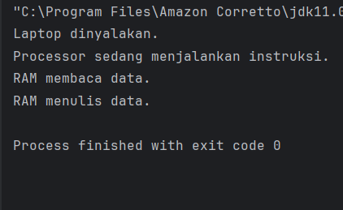

### Praktikum 4 - Polymorphism (Polimorfisme)
Polymorphism memungkinkan objek untuk memiliki banyak bentuk. Ini dapat dicapai melalui method overriding (mengganti metode di subclass) dan method overloading (beberapa metode dengan nama sama tetapi parameter berbeda).

#### Method Overriding
Method overriding terjadi ketika subclass (class anak) menyediakan implementasi spesifik untuk method yang sudah didefinisikan di superclass (class induk). Method overriding digunakan untuk mengubah atau memperluas perilaku method yang diwarisi dari superclass. Method yang di-override harus memiliki nama, parameter, dan return type yang sama dengan method di superclass.

#### Aturan Method Overriding:
- Method harus memiliki nama dan parameter yang sama dengan method di superclass.
- Return type harus sama atau subtype dari return type di superclass.
- Access modifier tidak boleh lebih restriktif daripada method di superclass (misalnya, jika method di superclass protected, method di subclass bisa protected atau public).
- Method tidak bisa di-override jika di superclass dideklarasikan sebagai final.

### Langkah Praktikum
1. Buat Sebuah package baru lagi didalam package modul_3 dengan cara klik kanan dan pilih New -> Package. Beri nama bagian_4
2. Kemudian buat sebuah package baru di dalam bagian_4 dan beri nama overriding
3. Kemudian buat sebuah class baru dengan nama Hewan dan isikan kode berikut:

        package praktikum_3.bagian_4.Overriding;
        
        public class Hewan {
        void bersuara() {
        System.out.println("Hewan bersuara.");
        }
        }
4. Kemudian buat sebuah class baru dengan nama Kucing dan isikan kode berikut:

        package praktikum_3.bagian_4.Overriding;
        
        public class Kucing extends Hewan {
        @Override
        void bersuara() {
        System.out.println("Meong!");
        }
        }
5. Kemudian buat sebuah class baru dengan nama Anjing dan isikan kode berikut:

        package praktikum_3.bagian_4.Overriding;
        
        public class Anjing extends Hewan{
        @Override
        void bersuara() {
        System.out.println("Guk-Guk!");
        }
        }
6. Kemudian buat sebuah class baru dengan nama Main dan isikan kode berikut:

        package praktikum_3.bagian_4.Overriding;
        
        public class Main {
        public static void main(String[] args) {
        Hewan hewan1 = new Kucing(); // Polymorphism
        Hewan hewan2 = new Anjing(); // Polymorphism
        hewan1.bersuara(); // Output: Meong!
        hewan2.bersuara(); // Output: Guk Guk!
        }
        }
7. Jalankan program untuk melihat hasilnya.
#### Screenshoot Hasil:
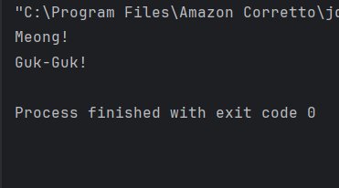

#### Method Overloading
Method overloading terjadi ketika sebuah class memiliki beberapa method dengan nama yang sama tetapi parameter yang berbeda (baik jumlah atau tipe parameternya). Method overloading digunakan untuk meningkatkan fleksibilitas dengan menyediakan beberapa cara untuk memanggil method yang sama.

#### Aturan Method Overloading:
- Method harus memiliki nama yang sama.
- Parameter harus berbeda (jumlah atau tipe).
- Return type bisa sama atau berbeda (tidak mempengaruhi overloading).
- Access modifier bisa sama atau berbeda.

### Langkah Praktikum
1. Buat sebuah package baru di dalam bagian_4 dan beri nama overloading
2. Kemudian buat sebuah class baru dengan nama Kalkulator dan isikan kode berikut:

        package praktikum_3.bagian_4.Overloading;
        
        public class Kalkulator {
        // Method overloading: penjumlahan dua bilangan bulat
        int tambah(int a, int b) {
        return a + b;
        }
        // Method overloading: penjumlahan tiga bilangan bulat
        int tambah(int a, int b, int c) {
        return a + b + c;
        }
        // Method overloading: penjumlahan dua bilangan desimal
        double tambah(double a, double b) {
        return a + b;
        }
        }
3. Kemudian buat sebuah class baru dengan nama Main dan isikan kode berikut:

        package praktikum_3.bagian_4.Overloading;
        
        public class Main {
        public static void main(String[] args) {
        Kalkulator kalkulator = new Kalkulator();
        System.out.println("Hasil 1: " + kalkulator.tambah(5, 10)); // Output: 15
        System.out.println("Hasil 2: " + kalkulator.tambah(5, 10, 15)); // Output: 30
        System.out.println("Hasil 3: " + kalkulator.tambah(3.5, 2.5)); // Output: 6.0
        }
        }
4. Jalankan program untuk melihat hasilnya.
#### Screenshoot Hasil
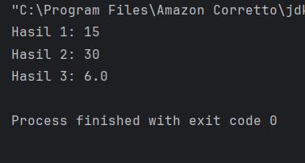

### Perbandingan Overriding dan Overloading
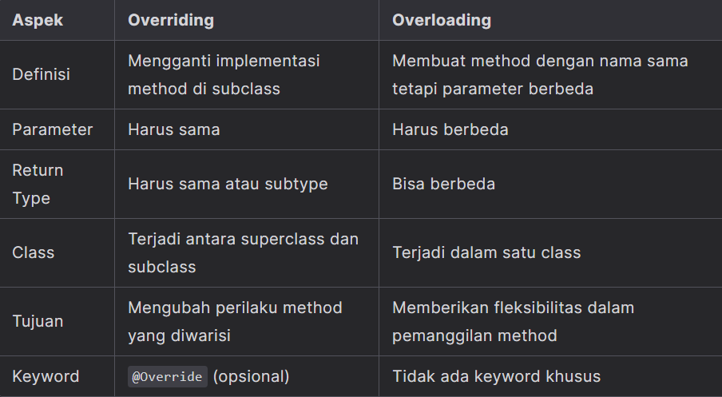

### Latihan - Prak 4
#### Latihan 1 : Overriding
1. Buat class BangunDatar dengan method hitungLuas().
2. Buat subclass Persegi dan Lingkaran yang meng-override method hitungLuas().
3. Implementasikan method hitungLuas() di masing-masing subclass.

- Bangundatar

        package praktikum_3.latihan.latihan_4Overriding;
        
        public class Bangundatar {
        double hitungLuas() {
        return 0;
        }
        }

- Persegi

        package praktikum_3.latihan.latihan_4Overriding;
        
        public class Persegi extends Bangundatar {
        double sisi = 4;
        @Override
        double hitungLuas() {
        return sisi * sisi;
        }
        }

- Lingkaran

        package praktikum_3.latihan.latihan_4Overriding;
        
        public class Lingkaran extends Bangundatar {
        double jariJari = 7;
        @Override
        double hitungLuas() {
        return 3.14 * jariJari * jariJari;
        }
        }

- Main

        package praktikum_3.latihan.latihan_4Overriding;
        
        public class Main {
        public static void main(String[] args) {
        Persegi persegi = new Persegi();
        Lingkaran lingkaran = new Lingkaran();
        System.out.println("Luas Persegi: " + persegi.hitungLuas());
        System.out.println("Luas Lingkaran: " + lingkaran.hitungLuas());
        }
        }
#### Screenshoot Hasil
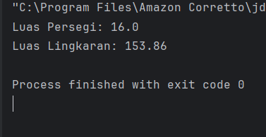

#### Latihan 2 : Overloading
1. Buat class Matematika dengan method tambah() yang dapat menerima 2 atau 3 parameter bertipe int.
2. Tambahkan method tambah() yang menerima 2 parameter bertipe double.

- Matematika

        package praktikum_3.latihan.latihan_4Overloading;
        
        public class Matematika {
        int tambah(int a, int b) {
        return a + b;
        }
        int tambah(int a, int b, int c) {
        return a + b + c;
        }
        double tambah(double a, double b) {
        return a + b;
        }
        
        }

- Main

        package praktikum_3.latihan.latihan_4Overloading;
        
        public class Main {
        public static void main(String[] args) {
        Matematika m = new Matematika();
        System.out.println("Hasil 1: " + m.tambah(5, 10));
        System.out.println("Hasil 2: " + m.tambah(5, 10, 15));
        System.out.println("Hasil 3: " + m.tambah(3.5, 2.5));
        }
        }
#### Screenshoot Hasil
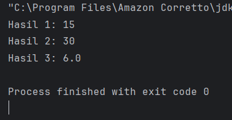

### Praktikum 5 - Abstraction (Abstraksi) | Abstract Class dan Interface
Pada konsep OOP (Object-Oriented Programming), Abstraction adalah salah satu dari empat pilar utama (bersama Encapsulation, Inheritance, dan Polymorphism). Abstraction memungkinkan kita untuk menyembunyikan detail implementasi dan hanya menampilkan fungsionalitas yang diperlukan kepada pengguna. Di Java, abstraction dapat diimplementasikan menggunakan Abstract Class dan Interface.

#### Abstract Class
Abstract class adalah class yang tidak dapat diinstansiasi (tidak bisa dibuat objeknya langsung). Abstract class dapat memiliki method abstrak (tanpa implementasi) dan method konkret (dengan implementasi). Abstract class digunakan ketika kita ingin membuat blueprint untuk class-class lain yang memiliki perilaku serupa tetapi dengan implementasi yang berbeda.

#### Ciri-Ciri Abstract Class:
- Dideklarasikan dengan keyword abstract.
- Dapat memiliki atribut, method konkret, dan method abstrak.
- Method abstrak tidak memiliki body (hanya deklarasi).
- Subclass yang mewarisi abstract class harus mengimplementasikan semua method abstrak (kecuali subclass tersebut juga abstract).

### Langkah Praktikum
1. Buat Sebuah package baru lagi didalam package modul_3 dengan cara klik kanan dan pilih New -> Package. Beri nama bagian_5
2. Buat sebuah package baru di dalam bagian_5 dan beri nama abstrak.
3. Kemudian buat sebuah class baru di dalam abstrak dengan nama Hewan dan isikan kode berikut:

        package praktikum_3.bagian_5.abstrak;
        
        abstract class Hewan {
        //atribut
        String nama;
        //Method konkret
        void makan () {
        System.out.println(nama + " sedang makan.");
        }
        //Method abstract
        abstract void bersuara();
        }
4. Kemudian buat sebuah class baru di dalam abtrak dengan nama Kucing dan isikan kode berikut:

        package praktikum_3.bagian_5.abstrak;
        
        class Kucing extends Hewan {
        @Override
        void bersuara() {
        System.out.println("Meong!");
        }
        }
5. Kemudian buat sebuah class baru di dalam abtrak dengan nama Anjing dan isikan kode berikut:

        package praktikum_3.bagian_5.abstrak;
        
        class Anjing extends Hewan {
        @Override
        void bersuara() {
        System.out.println("Guk-Guk!");
        }
        }
6. Kemudian buat sebuah class baru dengan nama Main dan isikan kode berikut:

        package praktikum_3.bagian_5.abstrak;
        
        public class Main {
        public static void main(String[] args) {
        Hewan kucing = new Kucing();
        kucing.nama = "Kitty";
        kucing.makan(); // Method konkret dari abstract class
        kucing.bersuara(); // Method abstrak yang di-override
        Hewan anjing = new Anjing();
        anjing.nama = "Doggy";
        anjing.makan(); // Method konkret dari abstract class
        anjing.bersuara(); // Method abstrak yang di-override
        }
        }
7. Jalankan program untuk melihat hasilnya.
#### Screenshoot Hasil
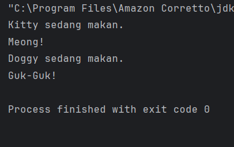

#### Interface
Interface adalah blueprint untuk class yang hanya berisi method abstrak (sebelum Java 8) atau method default/static (mulai Java 8). Interface digunakan untuk mendefinisikan kontrak (contract) yang harus diimplementasikan oleh class-class yang menggunakannya. Sebuah class dapat mengimplementasikan banyak interface (multiple inheritance).

#### Ciri-Ciri Interface:
- Dideklarasikan dengan keyword interface.
- Semua method di interface secara default adalah public dan abstract (tidak perlu menuliskan keyword abstract).
- Mulai Java 8, interface dapat memiliki method default (dengan implementasi) dan method static.
- Mulai Java 9, interface dapat memiliki method private.
- Interface tidak dapat memiliki atribut non-static (hanya konstanta, yaitu public static final).

### Langkah Praktikum
1. Buat sebuah package baru di dalam bagian_5 dan beri nama antarmuka.
2. Kemudian buat sebuah interface baru di dalam antarmuka dengan nama Bergerak dan isikan kode berikut:

        package praktikum_3.bagian_5.antarmuka;
        
        interface Bergerak {
        // Method abstrak
        void bergerak();
        // Method default (Java 8+)
        default void berhenti() {
        System.out.println("Berhenti bergerak.");
        }
        // Method static (Java 8+)
        static void info() {
        System.out.println("Ini adalah interface Bergerak.");
        }
        }
3. Kemudian buat sebuah class baru di dalam antarmuka dengan nama Mobil dan isikan kode berikut:

        package praktikum_3.bagian_5.antarmuka;
        
        class Mobil implements Bergerak {
        @Override
        public void bergerak() {
        System.out.println("Mobil sedang melaju");
        }
        }
4. Kemudian buat sebuah class baru di dalam antarmuka dengan nama Pesawat dan isikan kode berikut:

        package praktikum_3.bagian_5.antarmuka;
        
        class Pesawat implements Bergerak {
        @Override
        public void bergerak() {
        System.out.println("Pesawat sedang terbang");
        }
        }
5. Kemudian buat sebuah class baru dengan nama Main dan isikan kode berikut:

        package praktikum_3.bagian_5.antarmuka;
        
        public class Main {
        public static void main(String[] args) {
        Bergerak mobil = new Mobil();
        mobil.bergerak(); // Method dari interface
        mobil.berhenti(); // Method default dari interface
        Bergerak pesawat = new Pesawat();
        pesawat.bergerak(); // Method dari interface
        pesawat.berhenti(); // Method default dari interface
        Bergerak.info(); // Method static dari interface
        }
        
        }
6. Jalankan program untuk melihat hasilnya.
#### Screenshoot Hasil
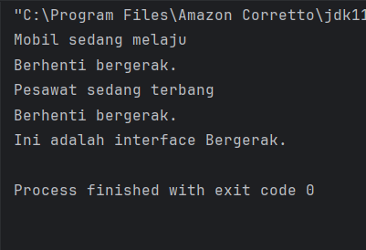

#### Perbandingan Abstract Class dan Interface
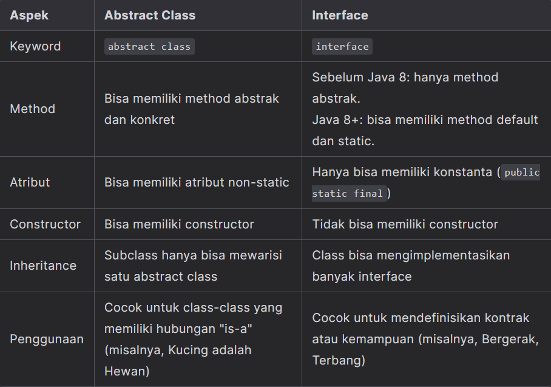

#### Kapan Menggunakan Abstract Class dan Interface
##### Gunakan Abstract Class Jika:
- Anda ingin membuat blueprint untuk class-class yang memiliki perilaku dan atribut yang sama.
- Anda ingin memiliki method konkret yang dapat diwarisi oleh subclass.
- Anda ingin mengontrol state objek melalui atribut non-static.

##### Gunakan Interface Jika:
- Anda ingin mendefinisikan kontrak atau kemampuan yang harus diimplementasikan oleh class-class yang berbeda.
- Anda ingin mendukung multiple inheritance (sebuah class bisa mengimplementasikan banyak interface).
- Anda ingin menambahkan fungsionalitas tambahan ke class tanpa mengubah struktur class tersebut (menggunakan method default di Java 8+).

Dalam Sebuah program, kita juga dapat mengkombinasikan abstract class dengan interface.

### Langkah Praktikum
1. Didalam package bagian_5, buatlah sebuah class baru dan beri nama Main dan isikan kode berikut:

        package praktikum_3.bagian_5;
        
        interface Terbang {
        void terbang();
        }
        // Abstract Class
        abstract class Hewan {
        String nama;
        abstract void bersuara();
        }
        // Class yang mewarisi abstract class dan mengimplementasikan interface
        class Burung extends Hewan implements Terbang {
        @Override
        void bersuara() {
        System.out.println("Kicau kicau!");
        }
        @Override
        public void terbang() {
        System.out.println(nama + " sedang terbang.");
        }
        }
        public class Main {
        public static void main(String[] args) {
        Burung burung = new Burung();
        burung.nama = "Merpati";
        burung.bersuara();
        burung.terbang();
        }
        }
2. Jalankan program untuk melihat hasilnya.
#### Screenshoot Hasil
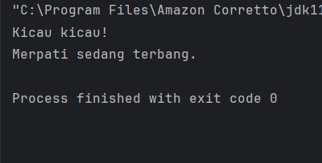

### Latihan - Prak 5
1. Buat sebuah interface Berenang dengan method berenang().
2. Buat abstract class HewanAir dengan atribut nama dan method abstrak makan().
3. Buat class Ikan yang mewarisi HewanAir dan mengimplementasikan Berenang.
4. Implementasikan method berenang() dan makan() di class Ikan.

- Berenang

        package praktikum_3.latihan.latihan_5;
        
        interface Berenang {
        void berenang();
        }
- HewanAir

         package praktikum_3.latihan.latihan_5;
        
         abstract class HewanAir {
         String nama;
         HewanAir(String nama) {
         this.nama = nama;
         }
         abstract void makan();
         }
- Ikan

        package praktikum_3.latihan.latihan_5;
        
        class Ikan extends HewanAir implements Berenang {
        Ikan(String nama) {
        super(nama);
        }
        @Override
        public void berenang() {
        System.out.println(nama + " sedang berenang.");
        }
        @Override
        void makan() {
        System.out.println(nama + " sedang makan.");
        }
        }
- Main

        package praktikum_3.latihan.latihan_5;
        
        public class Main {
        public static void main(String[] args) {
        Ikan ikan = new Ikan("Nemo");
        ikan.berenang();
        ikan.makan();
        }
        }
#### Screenshoot Hasil
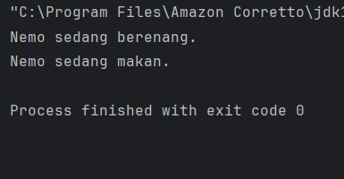

### Praktikum 6 - Aplikasi Console Pemesanan Tiket Sederhana
Berikut adalah contoh aplikasi console pemesanan tiket untuk sebuah konferensi yang mengimplementasikan seluruh konsep OOP (Class, Object, Encapsulation, Inheritance, Polymorphism, dan Abstraction). Aplikasi ini memiliki fitur lengkap seperti:

1. Menampilkan daftar tiket yang tersedia.
2. Memesan tiket.
3. Melihat detail pesanan.
4. Membatalkan pesanan.
5. Menghitung total harga.
6. Menerapkan diskon berdasarkan jenis tiket.

### Langkah Praktikum
1. Buat Sebuah package baru lagi didalam package modul_3 dengan cara klik kanan dan pilih New -> Package. Beri nama bagian_6
2. Kemudian buat sebuah class baru dengan nama Tiket dan isikan kode berikut:

        package praktikum_3.bagian_6;
        
        abstract class Tiket {
        private final String jenis;
        private final double harga;
        public Tiket(String jenis, double harga) {
        this.jenis = jenis;
        this.harga = harga;
        }
        public String getJenis() {
        return jenis;
        }
        public double getHarga() {
        return harga;
        }
        // Abstract method untuk menghitung diskon
        public abstract double hitungDiskon();
        }
3. Kemudian buat sebuah class baru dengan nama TiketReguler dan isikan kode berikut:

        package praktikum_3.bagian_6;
        
        class TiketReguler extends Tiket {
        public TiketReguler() {
        super ("Reguler", 100000);
        }
        @Override
        public double hitungDiskon() {
        return 0;
        }
        }
4. Kemudian buat sebuah class baru dengan nama TiketVIP dan isikan kode berikut:

        package praktikum_3.bagian_6;
        
        class TiketVIP extends Tiket {
        public TiketVIP() {
        super ("VIP", 250000);
        }
        @Override
        public double hitungDiskon() {
        return 0.1* getHarga();
        }
        }
5. Kemudian buat sebuah class baru dengan nama Pesanan dan isikan kode berikut:

        package praktikum_3.bagian_6;
        
        class Pesanan {
        private final String namaPemesan;
        private final Tiket tiket;
        private final int jumlah;
        public Pesanan(String namaPemesan, Tiket tiket, int jumlah) {
        this.namaPemesan = namaPemesan;
        this.tiket = tiket;
        this.jumlah = jumlah;
        }
        public String getNamaPemesan() {
        return namaPemesan;
        }
        public Tiket getTiket() {
        return tiket;
        }
        public int getJumlah() {
        return jumlah;
        }
        // Menghitung total harga setelah diskon
        public double hitungTotal() {
        double total = tiket.getHarga() * jumlah;
        double diskon = tiket.hitungDiskon() * jumlah;
        return total - diskon;
        }
        // Menampilkan detail pesanan
        public void displayDetail() {
        System.out.println("\nDetail Pesanan:");
        System.out.println("Nama Pemesan: " + namaPemesan);
        System.out.println("Jenis Tiket: " + tiket.getJenis());
        System.out.println("Jumlah: " + jumlah);
        System.out.println("Total Harga: Rp " + hitungTotal());
        }
        }
6. Kemudian buat sebuah class baru dengan nama KonferensiApp dan isikan kode berikut:

        package praktikum_3.bagian_6;
        
        import java.util.ArrayList;
        import java.util.Scanner;
        public class KonferensiApp {
        private static final ArrayList<Pesanan> daftarPesanan = new ArrayList<>();
        private static final Scanner scanner = new Scanner(System.in);
        public static void main(String[] args) {
        while (true) {
        System.out.println("\n=== Aplikasi Pemesanan Tiket Konferensi ===");
        System.out.println("1. Lihat Daftar Tiket");
        System.out.println("2. Pesan Tiket");
        System.out.println("3. Lihat Detail Pesanan");
        System.out.println("4. Batalkan Pesanan");
        System.out.println("5. Keluar");
        System.out.print("Pilih menu: ");
        int pilihan = scanner.nextInt();
        scanner.nextLine(); // Membersihkan newline
        switch (pilihan) {
        case 1:
        lihatDaftarTiket();
        break;
        case 2:
        pesanTiket();
        break;
        case 3:
        lihatDetailPesanan();
        break;
        case 4:
        batalkanPesanan();
        break;
        case 5:
        System.out.println("Terima kasih telah menggunakan aplikasi ini.");
        System.exit(0);
        default:
        System.out.println("Pilihan tidak valid. Silakan coba lagi.");
        }
        }
        } // main sudah ditutup dengan benar
        // Method untuk menampilkan daftar tiket
        private static void lihatDaftarTiket() {
        System.out.println("\nDaftar Tiket:");
        System.out.println("1. Tiket Reguler - Rp100.000");
        System.out.println("2. Tiket VIP - Rp250.000 (Diskon 10%)");
        }
        // Method untuk memesan tiket
        private static void pesanTiket() {
        System.out.print("\nMasukkan nama pemesan: ");
        String namaPemesan = scanner.nextLine();
        System.out.print("Pilih jenis tiket (1: Reguler, 2: VIP): ");
        int jenisTiket = scanner.nextInt();
        System.out.print("Masukkan jumlah tiket: ");
        int jumlah = scanner.nextInt();
        Tiket tiket = null;
        switch (jenisTiket) {
        case 1:
        tiket = new TiketReguler();
        break;
        case 2:
        tiket = new TiketVIP();
        break;
        default:
        System.out.println("Jenis tiket tidak valid.");
        return;
        }
        Pesanan pesanan = new Pesanan(namaPemesan, tiket, jumlah);
        daftarPesanan.add(pesanan);
        System.out.println("Pesanan berhasil dibuat!");
        pesanan.displayDetail();
        }
        // Method untuk melihat detail pesanan
        private static void lihatDetailPesanan() {
        if (isNoPesanan()) return;
        System.out.print("Pilih nomor pesanan untuk melihat detail: ");
        int nomorPesanan = scanner.nextInt();
        if (nomorPesanan > 0 && nomorPesanan <= daftarPesanan.size()) {
        daftarPesanan.get(nomorPesanan - 1).displayDetail();
        } else {
        System.out.println("Nomor pesanan tidak valid.");
        }
        }
        private static boolean isNoPesanan() {
        if (daftarPesanan.isEmpty()) {
        System.out.println("\nBelum ada pesanan.");
        return true;
        }
        System.out.println("\nDaftar Pesanan:");
        for (int i = 0; i < daftarPesanan.size(); i++) {
        System.out.println((i + 1) + ". " + daftarPesanan.get(i).getNamaPemesan());
        }
        return false;
        }
        // Method untuk membatalkan pesanan
        private static void batalkanPesanan() {
        if (isNoPesanan()) return;
        System.out.print("Pilih nomor pesanan yang ingin dibatalkan: ");
        int nomorPesanan = scanner.nextInt();
        if (nomorPesanan > 0 && nomorPesanan <= daftarPesanan.size()) {
        daftarPesanan.remove(nomorPesanan - 1);
        System.out.println("Pesanan berhasil dibatalkan.");
        } else {
        System.out.println("Nomor pesanan tidak valid.");
        }
        }
        }
##### Screenshoot Hasil
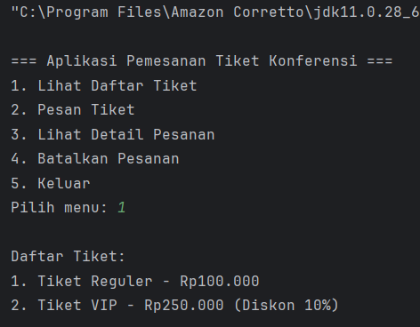
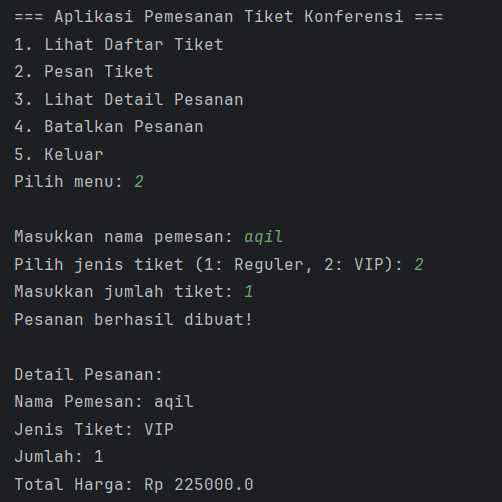
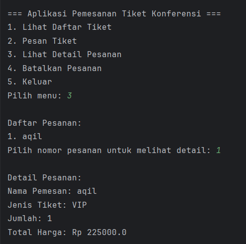
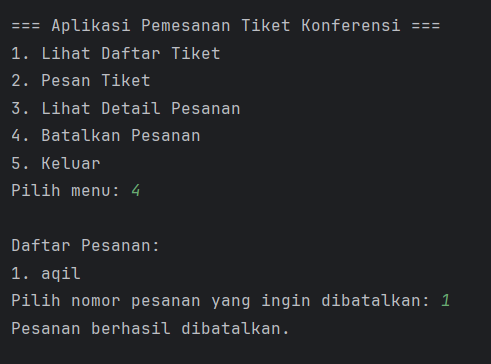

#### Fitur Aplikasi
1. Lihat Daftar Tiket: Menampilkan jenis tiket dan harganya.
2. Pesan Tiket: Memungkinkan pengguna memesan tiket dengan memilih jenis dan jumlah.
3. Lihat Detail Pesanan: Menampilkan detail pesanan berdasarkan nomor pesanan.
4. Batalkan Pesanan: Menghapus pesanan berdasarkan nomor pesanan.
5. Hitung Total Harga: Menghitung total harga setelah diskon (jika ada).

#### Penjelasan Program:
1. Encapsulation: Atribut seperti jenis dan harga dienkapsulasi dalam class Tiket.
2. Inheritance: TiketReguler dan TiketVIP mewarisi class Tiket.
3. Polymorphism: Method hitungDiskon() di-override di subclass.
4. Abstraction: Class Tiket adalah abstract class dengan method abstrak hitungDiskon().

Aplikasi ini siap digunakan dan dapat dikembangkan lebih lanjut dengan menambahkan fitur seperti penyimpanan data ke file atau database. Selamat mencoba!

## 3. Kesimpulan
Empat pilar Object-Oriented Programming (OOP) yaitu Encapsulation, Inheritance, Polymorphism, dan Abstraction merupakan dasar penting dalam pengembangan program menggunakan Java. Keempat konsep ini saling melengkapi dalam membangun sistem yang terstruktur, efisien, dan mudah dikembangkan.

Encapsulation membantu menjaga keamanan data dengan membatasi akses langsung, Inheritance memungkinkan penggunaan kembali kode sehingga lebih efisien, Polymorphism memberikan fleksibilitas dalam penggunaan metode, dan Abstraction menyederhanakan kompleksitas program dengan hanya menampilkan bagian yang penting.

Dengan memahami dan menerapkan keempat pilar tersebut, programmer dapat menghasilkan program yang lebih rapi, mudah dipelihara, serta memiliki kualitas yang lebih baik dalam pengembangan perangkat lunak.

## 4. Referensi
https://hackmd.io/@mohdrzu/rk5sz2X21l

