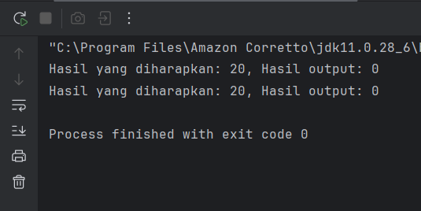
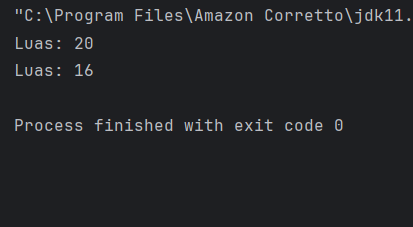
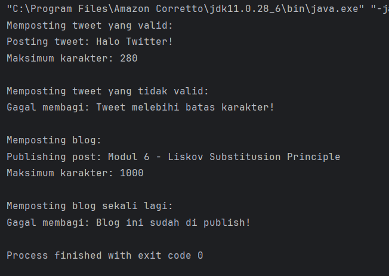
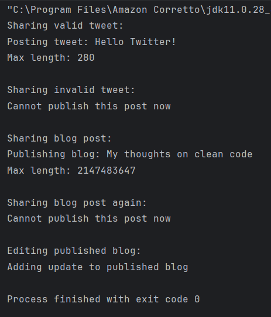
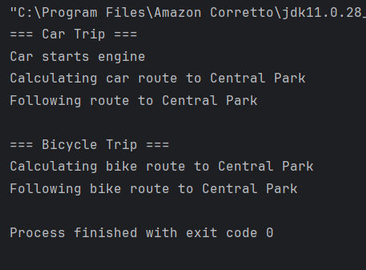

# Laporan 6 : LSP & Strategy Pattern
**Mata Kuliah:** Praktikum Design Pattern  
**Nama:** [Muhammad Aqil Yuanza]  
**NIM:** [2024573010101]  
**Kelas:** [TI 2A]

---

## 1. Abstrak LSP & Strategy Pattern  
Liskov Substitution Principle adalah salah satu prinsip dalam SOLID principles yang pertama kali diperkenalkan oleh Barbara Liskov pada tahun 1987. Prinsip ini menyatakan:

"Jika S adalah subtype dari T, maka objek-objek dari tipe T dalam program harus dapat digantikan dengan objek-objek dari tipe S tanpa mengubah sifat-sifat dari program."

Dalam konteks pemrograman berorientasi objek, ini berarti kelas turunan (subclass) harus bisa digunakan sebagai pengganti kelas induknya (superclass) tanpa menyebabkan kesalahan atau perubahan perilaku yang tidak diinginkan. Objek dari kelas turunan bisa digunakan di mana pun objek dari kelas induknya digunakan tanpa merusak atau mengubah perilaku program yang sudah berjalan dengan benar.

Tujuan utama dari LSP adalah untuk menjaga keandalan dan kestabilan program saat melakukan substitusi objek. Artinya, ketika kita menggunakan objek dari kelas turunan, program tetap bekerja seperti ketika menggunakan objek dari kelas induknya.
### Penjelasan Prinsip LSP dengan Contoh
#### Contoh pelanggaran LSP
Misalnya, kita memiliki sebuah kelas induk Kendaraan dan sebuah method bergerak() seperti berikut:

    class Kendaraan {
    public void bergerak() {
    System.out.println("Kendaraan bergerak...");
    }
    }

    // Subclass Mobil
    class Mobil extends Kendaraan {
    @Override
    public void bergerak() {
    System.out.println("Mobil melaju di jalan...");
    }
    }

    // Subclass KapalSelam - pelanggaran LSP
    class KapalSelam extends Kendaraan {
    @Override
    public void bergerak() {
    throw new UnsupportedOperationException("Kapal selam tidak bisa bergerak di darat!");
    }
    }
    
    // Main program
    public class Main {
    public static void jalankanKendaraan(Kendaraan k) {
    k.bergerak(); // Akan error jika objek KapalSelam digunakan
    }

    public static void main(String[] args) {
        Kendaraan mobil = new Mobil();
        Kendaraan kapalSelam = new KapalSelam();

        jalankanKendaraan(mobil);        // OK
        jalankanKendaraan(kapalSelam);   // Error: UnsupportedOperationException
    }
    }

Contoh kode diatas melanggar aturan LSP karena:

>Kendaraan adalah superclass yang memiliki method bergerak().

>Mobil dan KapalSelam adalah subclass yang mewarisi class Kendaraan.

>Namun, KapalSelam mengubah perilaku dari method bergerak() dengan cara memberikan output error jika digunakan sebagai object dari Kendaraan.

Berdasarkan pernyataan dari prinsip LSP, contoh kode diatas sudah melanggar karena, ketika kita menggunakan KapalSelam sebagai Kendaraan, program menjadi error karena bergerak() tidak bisa dijalankan.

Ini menunjukkan bahwa KapalSelam tidak bisa menggantikan Kendaraan dengan aman.

Untuk memperbaiki kode diatas agar memenuhi aturan dari LSP, kita harus mengubah desain kelasnya agar tidak memaksa subclass untuk mengimplementasikan perilaku yang tidak cocok untuk mereka. kita bisa memisahkan tanggung jawab antar jenis kendaraan melalui interface, sehingga setiap objek hanya menerima perilaku yang benar-benar relevan dengannya. Tidak ada subclass yang melempar error atau mengubah kontrak perilaku superclass.

Gunakan Abstraksi yang Lebih Tepat. Masalah muncul karena kita membuat subclass KapalSelam mewarisi dari class Kendaraan, dan class Kendaraan punya method bergerak() yang tidak relevan atau tidak cocok untuk subclass KapalSelam.

#### Contoh kode yang memenuhi aturan LSP
    Untuk memperbaikinya, kita bisa melakukan refactoring hierarki pewarisan menjadi lebih spesifik seperti berikut:
    
    // Interface umum untuk semua kendaraan
    interface Kendaraan {}
    
    // Interface khusus untuk kendaraan darat
    interface KendaraanDaratan extends Kendaraan {
    void bergerak();
    }
    
    // Interface khusus untuk kendaraan laut
    interface KendaraanLaut extends Kendaraan {
    void menyelam();
    }
    
    // Implementasi Mobil sebagai kendaraan darat
    class Mobil implements KendaraanDaratan {
    public void bergerak() {
    System.out.println("Mobil melaju di jalan...");
    }
    }
    
    // Implementasi KapalSelam sebagai kendaraan laut
    class KapalSelam implements KendaraanLaut {
    public void menyelam() {
    System.out.println("Kapal selam menyelam di laut...");
    }
    }
    
    // Main program
    public class Main {
    public static void jalankanKendaraanDaratan(KendaraanDaratan k) {
    k.bergerak();
    }

    public static void jalankanKendaraanLaut(KendaraanLaut k) {
        k.menyelam();
    }

    public static void main(String[] args) {
        Mobil mobil = new Mobil();
        KapalSelam kapalSelam = new KapalSelam();

        jalankanKendaraanDaratan(mobil);     // OK
        jalankanKendaraanLaut(kapalSelam);   // OK
    }
    }

Dari contoh kode yang sudah di refactor diatas, kita bisa lihat bahwa:

>Class Kendaraan dipecah menjadi dua jenis yang lebih spesifik dan relevan, yaitu KendaraanDaratan yang memiliki method bergerak() dan KendaraanLaut memiliki method menyelam()

>Class Mobil mengimplementasikan KendaraanDaratan, karena memang bergerak di darat.

>Class KapalSelam mengimplementasikan KendaraanLaut, karena bergerak di laut.

Dengan demikian, kode diatas sudah memenuhi kesesuaian dengan LSP, yaitu, class Mobil bisa digunakan sebagai argumen dari method dengan tipe KendaraanDaratan, dan tidak menimbulkan error. Class KapalSelam bisa digunakan sebagai argumen dari method dengan tipe KendaraanLaut, dan berfungsi sebagaimana mestinya.

Tidak ada subclass yang mengabaikan kontrak dari interface-nya atau memberikan error karena fungsi yang tidak relevan.
## 2. Praktikum
### Praktikum 1 - Rectangle-Square Problem
### Kode yang melanggar aturan LSP
1. Buat sebuah package baru di dalam modul_6 dan beri nama praktikum_1
2. Buat sebuah package baru di dalam praktikum_1 dan beri nama tanpa_lsp
3. Buat class baru di dalam tanpa_lsp dengan nama Rectangle, Square dan Main kemudian isikan kode seperti berikut:

#### Rectangle
    package praktikum_6.praktikum_1.tanpa_lsp;

    public class Rectangle {
    protected int width;
    protected int height;

    public void setWidth(int width) {
        this.width = width;
    }

    public void setHeight(int width) {
        this.height = height;
    }

    public int calculateArea() {
        return width * height;
    }
    }

#### Square
    package praktikum_6.praktikum_1.tanpa_lsp;
    
    public class Square extends Rectangle{
    @Override
    public void setWidth(int width) {
    super.setWidth(width);
    super.setHeight(width); // Violation: Merubah property height
    }  

    @Override
    public void setHeight(int height) {
        super.setHeight(height);
        super.setWidth(height); // Violation: Merubah property height
    }
    }

#### Main
    package praktikum_6.praktikum_1.tanpa_lsp;
    
    public class Main {
    public static void testRectangle(Rectangle r) {
    r.setWidth(5);
    r.setHeight(4);
    System.out.println("Hasil yang diharapkan: 20, Hasil output: " + r.calculateArea());
    }

    public static void main(String[] args) {
        Rectangle rect = new Rectangle();
        testRectangle(rect); // Hasilnya benar

        Rectangle square = new Square();
        testRectangle(square); // Gagal! Nilai yang di outputkan 16, Seharusnya 20
    }
    }

4. Jalankan dan lihat hasilnya.
#### Hasil Output

#### Permasalahan dari kode diatas:

>Square adalah subclass dari Rectangle.

>Namun, Square mengubah perilaku dari setWidth() dan setHeight(). Ketika kita mengubah lebar persegi (width), tingginya (height) juga otomatis berubah, dan sebaliknya.

>Ini berbeda dari ekspektasi pengguna Rectangle, yang berasumsi setWidth() hanya mengubah lebar, dan setHeight() hanya mengubah tinggi.

#### Dampak:
>Fungsi testRectangle() mengasumsikan bahwa dia bisa mengatur lebar dan tinggi secara independen.

>Saat dipanggil dengan objek Square, hasil calculateArea() tidak sesuai ekspektasi:

r.setWidth(5) → width = 5, height = 5

r.setHeight(4) → height = 4, width = 4

Area dihitung 4 * 4 = 16, bukan 20 seperti yang diharapkan.

>Program gagal karena kontrak dari superclass (Rectangle) telah dilanggar oleh subclass (Square).

### Refactor kode di atas untuk mematuhi aturan LSP
1. Buat sebuah package baru di dalam praktikum_1 dan beri nama dengan_lsp
2. Buat sebuah interface dengan nama Shape dan isikan kode berikut:

        package praktikum_6.praktikum_1.dengan_lsp;
        
        public interface Shape {
        int calculateArea();
        }
3. Buat sebuah class dengan nama Rectangle dan isikan kode berikut:

        package praktikum_6.praktikum_1.dengan_lsp;
        
        public class Rectangle implements Shape{
        private int width;
        private int height;
    
        public Rectangle(int width, int height) {
            this.width = width;
            this.height = height;
        }
    
        @Override
        public int calculateArea() {
            return width * height;
        }
        }
4. Buat sebuah class dengan nama Square dan isikan kode berikut:

        package praktikum_6.praktikum_1.dengan_lsp;
        
        public class Square implements Shape {
        private int side;
    
        public Square(int side) {
            this.side = side;
        }
    
        @Override
        public int calculateArea() {
            return side * side;
        }
        }
5. Buat sebuah class Main dan isikan kode berikut:

        package praktikum_6.praktikum_1.dengan_lsp;
        
        public class Main {
        public static void printArea(Shape shape) {
        System.out.println("Luas: " + shape.calculateArea());
        }
    
        public static void main(String[] args) {
            Shape rectangle = new Rectangle(5, 4);
            Shape square = new Square(4);
    
            printArea(rectangle); // Luas: 20
            printArea(square); // Luas: 16
        }
        }
6. Jalankan dan lihat hasilnya.
#### Hasil Output

#### Analisa Solusi:
Pada versi yang benar:

>Rectangle dan Square tidak saling mewarisi.

>Keduanya mengimplementasikan interface Shape secara terpisah.

>Masing-masing bertanggung jawab penuh terhadap perilaku menghitung area (calculateArea()).

#### Dampak
Prinsip LSP terpenuhi, karenaRectangle dan Square dapat diperlakukan sebagai Shape tanpa perubahan perilaku.

Fungsi printArea cukup tahu bahwa objeknya adalah Shape, dan cukup memanggil calculateArea() tanpa khawatir bentuk spesifiknya.

Area dihitung sesuai ekspektasi:
>Rectangle (5x4) → Area: 20

>Square (4x4) → Area: 16

### Praktikum 2 - Sistem Posting Media Sosial
### Kode yang melanggar aturan OCP
1. Buat sebuah package baru di dalam modul_6 dan beri nama praktikum_2
2. Buat sebuah package baru di dalam praktikum_2 dan beri nama tanpa_lsp
3. Buat class baru di dalam tanpa_lsp dengan nama SocialMediaPost dan isikan kode seperti berikut:

        package praktikum_6.praktikum_2.tanpa_lsp;
        
        public class SocialMediaPost {
        protected String content;
    
        public SocialMediaPost(String content) {
            this.content = content;
        }
    
        public void publish() {
            System.out.println("Publishing post: " + content);
        }
    
        public int calculateMaxCharacters() {
            return 1000; // Batas karakter
        }
        }
4. Buat class TwitterPost dan isikan kode berikut:

        package praktikum_6.praktikum_2.tanpa_lsp;
        
        public class TwitterPost extends SocialMediaPost{
        public TwitterPost(String content) {
        super(content);
        }
    
        @Override
        public int calculateMaxCharacters() {
            return 280; // Batas karakter twitter
        }
    
        @Override
        public void publish() {
            if (content.length() > calculateMaxCharacters()) {
                throw new IllegalArgumentException("Tweet melebihi batas karakter!");
            }
            System.out.println("Posting tweet: " + content);
        }
        }
5. Buat class BlogPost dan isikan kode berikut:

        package praktikum_6.praktikum_2.tanpa_lsp;
        
        public class BlogPost extends SocialMediaPost{
        private boolean isDraft;
    
        public  BlogPost(String content) {
            super(content);
            this.isDraft = true;
        }
    
        @Override
        public void publish() {
            if (!isDraft) {
                throw new IllegalStateException("Blog ini sudah di publish!");
            }
            isDraft = false;
            super.publish();
        }
    
        public void editContent(String newContent) {
            if (!isDraft) {
                throw new IllegalStateException("Blog yang sudah di publish tidak bisa diedit!");
            }
            this.content = newContent;
        }
        }
 6. Buat class Main dan isikan kode berikut:

        package praktikum_6.praktikum_2.tanpa_lsp;
        
        public class Main {
        public static void sharePost(SocialMediaPost post) {
        try {
        post.publish();
        System.out.println("Maksimum karakter: " + post.calculateMaxCharacters());
        } catch (Exception e) {
        System.out.println("Gagal membagi: " + e.getMessage());
        }
        }

        public static void main(String[] args) {
        SocialMediaPost tweet = new TwitterPost("Halo Twitter!");
        SocialMediaPost longTweet = new TwitterPost("Tweet ini sangat panjang, dan melebihi batas karakter...".repeat(10));
        SocialMediaPost blog = new BlogPost("Modul 6 - Liskov Substitusion Principle");

        System.out.println("Memposting tweet yang valid:");
        sharePost(tweet);

        System.out.println("\nMemposting tweet yang tidak valid:");
        sharePost(longTweet); // Throws exception

        System.out.println("\nMemposting blog:");
        sharePost(blog);

        System.out.println("\nMemposting blog sekali lagi:");
        sharePost(blog); // Throws different exception
        }
        }
7. Jalankan dan lihat hasilnya.
#### Hasil Output

#### Permasalahan dari kode diatas
Pada kode diatas, kita memiliki:

SocialMediaPost sebagai superclass.TwitterPost dan BlogPost sebagai subclass. Namun, subclass mengubah perilaku publish() secara signifikan:

>TwitterPost melempar IllegalArgumentException jika melebihi batas karakter.

>BlogPost melempar IllegalStateException jika post sudah pernah dipublikasikan.

Sehingga, penggunaan SocialMediaPost di method sharePost() menjadi tidak aman dan harus menangani berbagai macam error yang tidak konsisten.

#### Pelanggaran terhadap LSP
>LSP dilanggar karena subclass (TwitterPost, BlogPost) tidak bisa digunakan secara aman sebagai pengganti superclass (SocialMediaPost).

>Method sharePost() harus aware terhadap kemungkinan kegagalan dan exception yang dilempar oleh subclass.

>Akibatnya, penggunaan polymorphism menjadi berisiko dan tidak transparan.

#### Dampak
>Kompleksitas bertambah di tempat yang menggunakan superclass (sharePost).

>Pola try-catch diperlukan untuk menangani perilaku tidak konsisten.

>Melemahkan prinsip substitusi karena kode harus mengetahui detail spesifik subclass.

### Refactor kode di atas untuk mematuhi aturan OCP
1. Buat sebuah package baru di dalam praktikum_2 dan beri nama dengan_lsp
2. Buat sebuah interface dengan nama Publishable dan isikan kode berikut:

        package praktikum_6.praktikum_2.dengan_lsp;
        
        public interface Publicshable {
        void publish();
        boolean canPublish();
        int getMaxContentLength();
        }
3. Buat sebuah class dengan nama SocialPost dan isikan kode berikut:

        package praktikum_6.praktikum_2.dengan_lsp;
        
        public class SocialPost implements Publicshable{
        protected String content;
    
        public SocialPost(String content) {
            this.content = content;
        }
    
        @Override
        public void publish() {
            System.out.println("Publishing: " + content);
        }
    
        @Override
        public boolean canPublish() {
            return content.length() <= getMaxContentLength();
        }
    
        @Override
        public int getMaxContentLength() {
            return 1000;
        }
        }
4. Buat sebuah class dengan nama TwitterPost dan isikan kode berikut:

        package praktikum_6.praktikum_2.dengan_lsp;
        
        public class TwitterPost implements Publicshable{
        private static final int MAX_LENGTH = 280;
        private String content;
    
        public TwitterPost(String content) {
            this.content = content;
        }
    
        @Override
        public void publish() {
            if (!canPublish()) {
                throw new IllegalArgumentException("Tweet exceeds " + MAX_LENGTH + " characters");
            }
            System.out.println("Posting tweet: " + content);
        }
    
        @Override
        public boolean canPublish() {
            return content.length() <= MAX_LENGTH;
        }
    
        @Override
        public int getMaxContentLength() {
            return MAX_LENGTH;
        }
        }
5. Buat sebuah class dengan nama BlogPost dan isikan kode berikut:

        package praktikum_6.praktikum_2.dengan_lsp;
        
        public class BlogPost implements Publicshable{
        private String content;
        private boolean isPublished;
    
        public BlogPost(String content) {
            this.content = content;
            this.isPublished = false;
        }
    
        @Override
        public void publish() {
            if (isPublished) {
                return; // Idempotent operation
            }
            isPublished = true;
            System.out.println("Publishing blog: " + content);
        }
    
        @Override
        public boolean canPublish() {
            return !isPublished;
        }
    
        @Override
        public int getMaxContentLength() {
            return Integer.MAX_VALUE; // No practical limit
        }
    
        public void editContent(String newContent) {
            if (isPublished) {
                System.out.println("Adding update to published blog");
            }
            this.content = newContent;
        }
        }
6. Buat sebuah class Main dan isikan kode berikut:

        package praktikum_6.praktikum_2.dengan_lsp;
        
        public class Main {
        public static void sharePost(Publicshable post) {
        if (post.canPublish()) {
        post.publish();
        System.out.println("Max length: " + post.getMaxContentLength());
        } else {
        System.out.println("Cannot publish this post now");
        }
        }

        public static void main (String[] args) {
        Publicshable tweet = new TwitterPost("Hello Twitter!");
        Publicshable longTweet = new TwitterPost("This is the way too long...".repeat(20));
        Publicshable blog = new BlogPost("My thoughts on clean code");

        System.out.println("Sharing valid tweet:");
        sharePost(tweet);

        System.out.println("\nSharing invalid tweet:");
        sharePost(longTweet);

        System.out.println("\nSharing blog post:");
        sharePost(blog);

        System.out.println("\nSharing blog post again:");
        sharePost(blog); // Now handles gracefully

        System.out.println("\nEditing published blog:");
        ((BlogPost)blog).editContent("Updated thoughts on clean mode");
        }
        }
7. Jalankan dan lihat hasilnya.
#### Hasil Output

#### Analisa solusi
Kode ini mendemonstrasikan bagaimana memperbaiki pelanggaran Liskov Substitution Principle (LSP) pada aplikasi media sosial. Dengan menggunakan interface Publishable, semua jenis post (SocialPost, TwitterPost, BlogPost) memiliki kontrak perilaku yang konsisten.

>Semua class (SocialPost, TwitterPost, BlogPost) mengimplementasikan interface yang sama (Publishable).

>Tidak ada class yang mengubah perilaku fundamental saat digunakan melalui interface Publishable.

>Fungsi sharePost(Publishable post) bisa menerima objek apapun tanpa error atau perlakuan khusus.

>Semua subclass bisa menggantikan** superclass/interface tanpa menyebabkan perilaku yang tidak diharapkan.

#### Benefit dari Perbaikan Ini
>Polymorphism: sharePost() tidak perlu tahu jenis objek.

>Konsistensi Perilaku: Semua post memiliki jaminan method publish(), canPublish(), dan getMaxContentLength().

>Lebih Mudah Diperluas: Menambahkan tipe post baru (misal InstagramPost) cukup dengan mengimplementasikan Publishable.

## 3. Latihan
### Aplikasi sistem navigasi kendaraan
Pada program ini, kita akan membuat sebuah sistem navigasi di mana beberapa kendaraan tidak dapat mengimplementasikan kontrak dari kelas dasar dengan benar. Kode program dibawah ini sudah di ubah sesuai aturan lsp.
1. Navigable

        package praktikum_6.praktikum_2.latihan;
        
        public interface Navigable {
        void navigateTo(String destination);
        }

2. EngineVehicle

        package praktikum_6.praktikum_2.latihan;
    
        public abstract class EngineVehicle implements Navigable {
    
        public void startEngine() {
            System.out.println("Engine started");
        }
        }

3. Car

        package praktikum_6.praktikum_2.latihan;
    
        public class Car extends EngineVehicle {
    
        @Override
        public void startEngine() {
            System.out.println("Car starts engine");
        }
    
        @Override
        public void navigateTo(String destination) {
            System.out.println("Calculating car route to " + destination);
            System.out.println("Following route to " + destination);
        }
        }

4. Bicycle

        package praktikum_6.praktikum_2.latihan;
    
        public class Bicycle implements Navigable {
    
        @Override
        public void navigateTo(String destination) {
            System.out.println("Calculating bike route to " + destination);
            System.out.println("Following bike route to " + destination);
        }
        }

5. Main

        package praktikum_6.praktikum_2.latihan;
    
        public class Main {
    
        public static void beginTrip(Navigable vehicle, String destination) {
            vehicle.navigateTo(destination);
        }
    
        public static void main(String[] args) {
    
        Car car = new Car();
        Bicycle bike = new Bicycle();
    
        System.out.println("=== Car Trip ===");
        car.startEngine();
        beginTrip(car, "Central Park");
    
        System.out.println("\n=== Bicycle Trip ===");
        beginTrip(bike, "Central Park");
        }
        }

6. Jalankan Program
#### Hasil Output

#### Analisis latihan LSP

Pada solusi ini prinsip Liskov Substitution Principle sudah terpenuhi karena:

>Bicycle tidak dipaksa memiliki method startEngine().

>Semua class hanya mengimplementasikan perilaku yang sesuai.

>Car dan Bicycle dapat digunakan sebagai Navigable.

>Tidak ada lagi exception ketika program dijalankan.

Dengan desain ini, program menjadi lebih fleksibel, mudah dikembangkan, dan sesuai dengan prinsip SOLID.

## 3. Kesimpulan :
Prinsip LSP menyatakan bahwa objek dari subclass harus bisa menggantikan objek dari superclass tanpa mengubah perilaku yang diinginkan dari program. Dengan kata lain, subclass harus menjaga kontrak yang ditetapkan oleh superclass, sehingga kode tetap berfungsi seperti yang diharapkan meskipun objek-objek tersebut digantikan. Ini mendorong desain yang lebih fleksibel dan mudah diperluas tanpa mempengaruhi kestabilan sistem yang ada.

Prinsip ini sangat penting dalam pengembangan perangkat lunak berorientasi objek, karena memastikan polimorfisme yang benar dan kode yang lebih mudah dipelihara serta diperluas di masa depan.

## 4. Referensi :
https://hackmd.io/@mohdrzu/ByhonGtkel

---

