# Laporan 1 : Review Dasar Pemograman Java
**Mata Kuliah:** Praktikum Design Pattern  
**Nama:** [Muhammad Aqil Yuanza]  
**NIM:** [2024573010101]  
**Kelas:** [TI 2A]

---

## 1. Abstrak
Dasar pemrograman Java merupakan konsep awal dalam mempelajari bahasa pemrograman Java yang digunakan untuk membuat berbagai jenis aplikasi. Materi yang dipelajari meliputi struktur dasar program, tipe data, variabel, operator, percabangan, perulangan, serta pengenalan konsep pemrograman berorientasi objek seperti class dan object. Pemahaman terhadap dasar-dasar ini penting agar programmer dapat menulis program yang terstruktur dan mudah dipahami. Dengan mempelajari dasar pemrograman Java, seseorang dapat memiliki fondasi yang kuat untuk mengembangkan aplikasi yang lebih kompleks di berbagai platform.
## 2. Praktikum
### Praktikum 1 - Pengenalan Java dan Lingkungan Pengembangan
#### Dasar Teori
Java adalah bahasa pemrograman berorientasi objek yang populer dan banyak digunakan untuk pengembangan aplikasi desktop, web, dan mobile. Java menggunakan sintaks yang mirip dengan C++ tetapi dirancang untuk lebih mudah dipahami dan digunakan.

Untuk memulai pemrograman Java, Anda perlu:

1. JDK (Java Development Kit): Berisi compiler dan tools untuk mengembangkan program Java.
2. IDE (Integrated Development Environment): Seperti IntelliJ IDEA, Eclipse, atau NetBeans untuk menulis dan menjalankan kode.

#### Langkah Praktikum
1. Pastikan JDK dan Intellij IDE Community Edition sudah terinstal. Jika belum, kunjungi url berikut untuk mengunduh JDK Amazon Correto dan Intellij
2. Buka IDE dan buat sebuah project
3. Buat sebuah package baru di dalam folder src dengan cara klik kanan pada folder src kemudian pilih New -> Package. Beri nama praktikum_1.
4. Buat Sebuah class didalam package praktikum_1 dengan cara klik kanan dan pilih New -> Java Class. Beri nama HelloWorld
5. Isikan kode dibawah ini.

         public class HelloWorld {
         public static void main(String[] args) {
         System.out.println("Hello, World!");
         }
         }
6. Jalankan program dengan menekan tombol segitiga hijau

#### Hasil Output
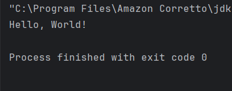

### Praktikum 2 - Variabel dan Tipe Data
#### Dasar Teori
Variabel digunakan untuk menyimpan data dalam program. Setiap variabel memiliki tipe data yang menentukan jenis nilai yang dapat disimpan. Tipe data dasar di Java:
1. int: Bilangan bulat (contoh: 10, -5)
2. double: Bilangan desimal (contoh: 3.14, -0.5)
3. boolean: Nilai true atau false
4. char: Karakter tunggal (contoh: 'A', '1')
5. String: Teks (contoh: "Hello")

#### Langkah Praktikum
1. Buat sebuah class baru di dalam package praktikum_1 dan beri nama Variable
2. Tuliskan kode berikut:

         public class Variabel {
         public static void main(String[] args) {
         int umur = 20;
         double tinggi = 1.75;
         boolean isMahasiswa = true;
         char jenisKelamin = 'L';
         String nama = "Budi";

         System.out.println("Nama: " + nama);
         System.out.println("Umur: " + umur);
         System.out.println("Tinggi: " + tinggi);
         System.out.println("Mahasiswa: " + isMahasiswa);
         System.out.println("Jenis Kelamin: " + jenisKelamin);
         }
         }
3. Jalankan program nya untuk melihat hasil.

#### Hasil Output
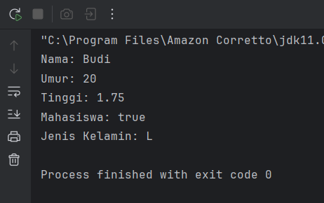

### Latihan - Prak 2
Buatlah program untuk menampilkan data diri anda yang lengkap dengan attribut seperti berikut:

Nama Lengkap, Tempat Lahir, Tanggal Lahir, Golongan Darah, Umur,
Tinggi Badan, Jenis Kelamin, Agama, Pekerjaan.

#### Hasil Latihan
#### Input :

        public class Datadiri {
        public static void main(String[] args) {
        int umur = 19;
        double tinggi = 1.70;
        char jenisKelamin = 'L';
        String nama = "Muhammad Aqil Yuanza";
        String tempatlahir = "Lhoksukon";
        String tanggallahir = "10 September 2006";
        String golongandarah = "O";
        String agama = "Islam";
        String pekerjaan = "Mahasiswa";

        System.out.println("Nama: " + nama);
        System.out.println("Tempat Lahir: " + tempatlahir);
        System.out.println("Tanggal Lahir: " + tanggallahir);
        System.out.println("Golongan Darah: " + golongandarah);
        System.out.println("Umur: " + umur);
        System.out.println("Tinggi Badan: " + tinggi);
        System.out.println("Jenis Kelamin: " + jenisKelamin);
        System.out.println("Agama:" + agama);
        System.out.println("Pekerjaan: " + pekerjaan);
    }
    }
#### Output :
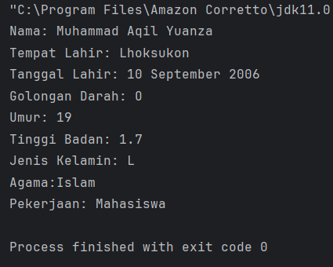

### Praktikum 3 - Operator dan Expressi
#### Dasar Teori
Operator digunakan untuk melakukan operasi pada variabel dan nilai. Jenis operator:

1. Aritmatika: +, -, *, /, %
2. Perbandingan: ==, !=, >, <, >=, <=
3. Logika: && (AND), || (OR), ! (NOT)

#### Langkah Praktikum
1. Buat sebuah class baru di dalam package praktikum_1 dan beri nama Operator
2. Tuliskan kode berikut:

        public class Operator {
        public static void main(String[] args) {
        int a = 10;
        int b = 5;

        System.out.println("a + b = " + (a + b));
        System.out.println("a > b? " + (a > b));
        System.out.println("a == b? " + (a == b));
         }
         }
3. Jalankan program nya untuk melihat hasil.

#### Hasil Output
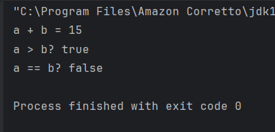

### Latihan - Prak 3
Buat program untuk menghitung luas persegi panjang (panjang * lebar)

#### Hasil Latihan 
#### Input :

        public class LuasPersegiPanjang {
        public static void main(String[] args) {
        Scanner input =  new Scanner(System.in);

        System.out.print("Masukkan panjang: ");
        double panjang = input.nextDouble();

        System.out.println("Masukkan lebar: ");
        double lebar = input.nextDouble();

        double luas = panjang * lebar;

        System.out.println("Luas persegi panjang = " + luas);

        input.close();
        }
        }
#### Output :
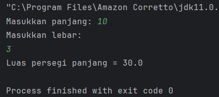

### Praktikum 4 - Percabangan (If-Else dan Switch-Case)
#### Dasar Teori
Percabangan digunakan untuk mengambil keputusan berdasarkan kondisi.

If-Else:

    if (kondisi) {
    // Blok kode jika kondisi true
    } else {
    // Blok kode jika kondisi false
    }

Switch-Case:

    switch (variabel) {
    case nilai1:
    // Blok kode jika variabel == nilai1
    break;
    case nilai2:
    // Blok kode jika variabel == nilai2
    break;
    default:
    // Blok kode jika tidak ada case yang sesuai
    }

#### Langkah Praktikum
1. Buat sebuah class baru di dalam package praktikum_1 dan beri nama Percabangan
2. Tuliskan kode berikut:

         public class Percabangan {
         public static void main(String[] args) {
         int nilai = 85;

         if (nilai >= 75) {
            System.out.println("Anda lulus!");
         } else {
            System.out.println("Anda tidak lulus.");
          }
        }
       }
3. Jalankan program nya untuk melihat hasil.

#### Hasil Output
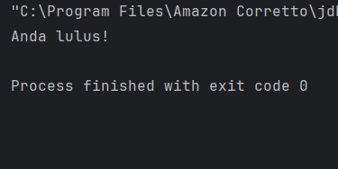

### Latihan - Prak 4
Buat program untuk menentukan apakah suatu bilangan genap atau ganjil.

#### Hasil Latihan
#### Input :

        public class GenapGanjil {
        public static void main(String[] args) {
        Scanner input = new Scanner(System.in);

        System.out.println("Masukkan sebuah bilangan: ");
        int angka = input.nextInt();

        if (angka % 2 == 0) {
            System.out.println(angka + " adalah bilangan genap.");
        } else {
            System.out.println(angka + " adalah bilangan genjil.");
        }

        input.close();
        }
        }
#### Output :
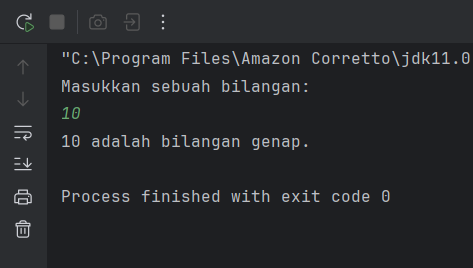

### Praktikum 5 - Perulangan (For, While, Do-While)
#### Dasar Teori
Perulangan digunakan untuk mengulang blok kode.

For:

    for (inisialisasi; kondisi; update) {
    // Blok kode yang diulang
    }

While:

    while (kondisi) {
    // Blok kode yang diulang
    }

Do-While:

    do {
    // Blok kode yang diulang
    } while (kondisi);

#### Langkah Praktikum
1. Buat sebuah class baru di dalam package praktikum_1 dan beri nama Perulangan
2. Tuliskan kode berikut:

         public class Perulangan {
         public static void main(String[] args) {
         for (int i = 1; i <=5; i++) {
         System.out.println("Iterasi ke-" + i);
         }
         }
         }
3. Jalankan program nya untuk melihat hasil.

#### Hasil Output
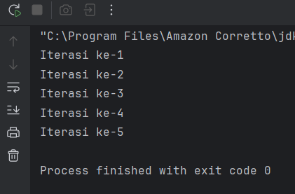

#### Latihan - Prak 5
Buat program untuk mencetak bilangan ganjil dari 1 hingga 20. Buat 3 program dengan menggunakan for, while, do-while.

#### Hasil Latihan
#### Input For :

    public class GanjilFor {
    public static void main(String[] args) {
    System.out.println("Bilangan ganjil 1-20 (for):");
    for (int i = 1; i <= 20; i++) {
    if (i % 2 != 0) {
    System.out.print(i + " ");
    }
    }
    }
    }

#### Output :
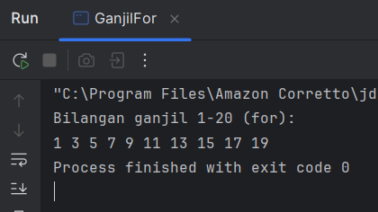

#### Input While :

    public class GanjilWhile {
    public static void main(String[] args) {
    System.out.println("Bilangan ganjil 1-20 (while):");
    int i = 1;
    while (i <= 20) {
    if (i % 2 != 0) {
    System.out.print(i + " ");
    }
    i++;
    }
    }
    }

#### Output :
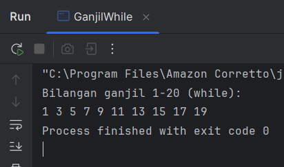

#### Input Do-While

    public class GanjilDoWhile {
    public static void main(String[] args) {
    System.out.println("Bilangan ganjil 1-20 (do-while):");
    int i = 1;
    do {
    if (i % 2 != 0) {
    System.out.print(i + " ");
    }
    i++;
    } while (i <= 20);
    }
    }

#### Output :
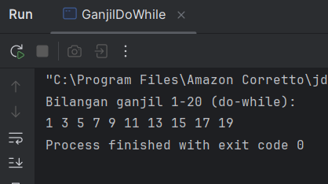

### Praktikum 6 - Practice Problem dan Solusinya
#### Dasar Teori
Practice Problem:

1. Buat program untuk menghitung faktorial dari suatu bilangan.
2. Buat program untuk mengecek apakah suatu bilangan adalah bilangan prima.
3. Buat program untuk mencetak pola segitiga menggunakan *.

#### Langkah Praktikum
1. Buat sebuah class baru di dalam package praktikum_1 dan beri nama Factorial dan isikan kode berikut. Kemudian jalankan untuk melihat hasilnya.

        public class Factorial {
        public static void main(String[] args) {
        int n = 5;
        int hasil = 1;
        for (int i = 1; i <= n; i++) {
        hasil *= i;
        }
        System.out.println("Faktorial dari " + n + " adalah" + hasil);
        }
        }
#### Output :
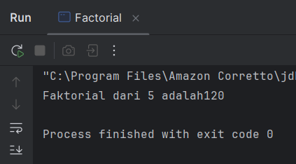

2. Buat sebuah class baru di dalam package praktikum_1 dan beri nama Prima dan isikan kode berikut. Kemudian jalankan untuk melihat hasilnya.

        public class Prima {
        public static void main(String[] args) {
        int n = 7;
        boolean isPrima = true;
        for (int i = 2; i <= n / 2; i++) {
        if (n % i == 0) {
        isPrima = false;
        break;
        }
        }
        System.out.println(n + (isPrima ? " adalah bilangan prima." : " bukan bilangan prima."));
        }
        }
#### Output :
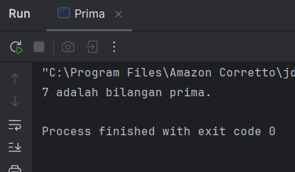

3. Buat sebuah class baru di dalam package praktikum_1 dan beri nama Segitiga dan isikan kode berikut. Kemudian jalankan untuk melihat hasilnya.

        public class Segitiga {
        public static void main(String[] args) {
        int tinggi = 5;
        for (int i = 1; i <= tinggi; i++) {
        for (int j = 1; j <= i; j++) {
        System.out.print("* ");
        }
        System.out.println();
        }
        }
        }
#### Output :
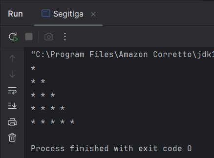

## 3. Kesimpulan :
Secara keseluruhan, dasar pemrograman Java memberikan pemahaman awal tentang bagaimana sebuah program dibuat dan dijalankan menggunakan bahasa Java. Dalam pembelajaran dasar ini, dipelajari konsep-konsep penting seperti struktur program Java, penggunaan variabel dan tipe data, operator, percabangan (if–else), perulangan, serta cara menampilkan dan menerima input dalam program.

Melalui pemahaman dasar tersebut, seseorang dapat mulai membangun logika pemrograman yang terstruktur dan sistematis. Java juga dikenal sebagai bahasa yang bersifat object-oriented, sehingga dasar-dasar ini menjadi fondasi penting sebelum mempelajari konsep yang lebih lanjut seperti class, object, inheritance, dan lainnya.

Dengan menguasai dasar pemrograman Java, pemula akan lebih mudah mengembangkan aplikasi sederhana hingga program yang lebih kompleks di tahap pembelajaran berikutnya.

## 4. Referensi :
https://hackmd.io/@mohdrzu/BkBn4sEcyl#Lab-01

